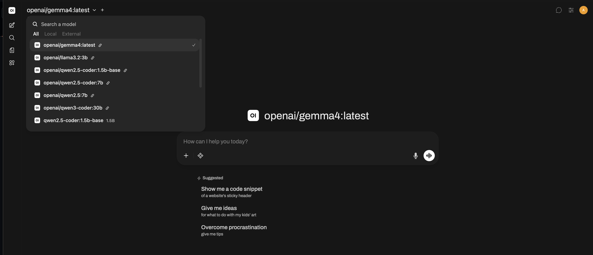
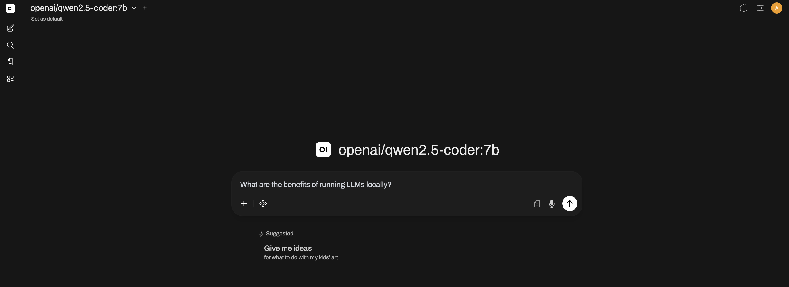
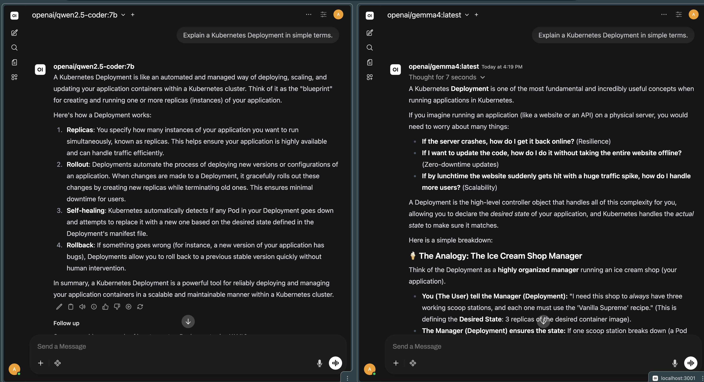
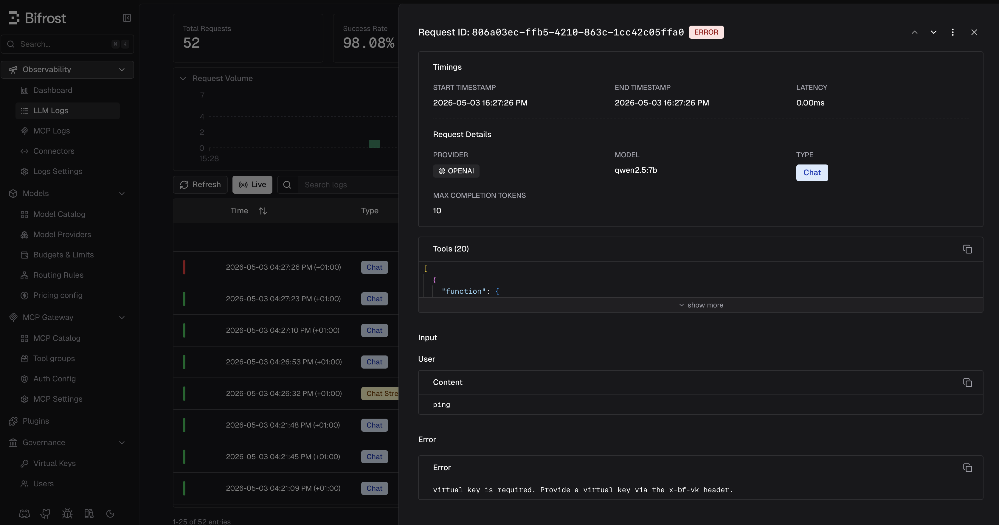

# Bifrost AI Gateway — Local Cluster Demo

A complete demo environment for [Bifrost AI Gateway](https://github.com/maximhq/bifrost) on a local k3d or kind cluster, including Kubernetes MCP tool integration, Ollama local model support, and governed agentic workflows.

## What This Repo Contains

```
bifrost-k8s-demo/
├── README.md
├── demo-sh-scripts
│   ├── 01-governance-block.sh
│   ├── 02-cost-attribution.sh
│   ├── 03-crashloop-diagnosis.sh
│   ├── 04-argocd-status.sh
│   ├── 05-kargo-pipeline.sh
│   ├── 06-llm-triage.sh
│   ├── 07-multi-tool-correlation.sh
│   ├── 08-local-vs-cloud.sh
│   └── 09-ollama-fast-query.sh
├── docs
│   ├── AWS MCP Server — Deployment & Demo Guide.md
│   ├── Argo CD MCP Server — Deployment Guide.md
│   ├── Azure MCP Server — Deployment & Demo Guide.md
│   ├── Datadog MCP Server — Deployment & Demo Guide.md
│   ├── Dynatrace MCP Server — Deployment & Demo Guide.md
│   ├── GitHub MCP Server — Deployment & Demo Guide.md
│   ├── Grafana MCP Server — Deployment & Demo Guide.md
│   ├── Prometheus MCP Server — Deployment & Demo Guide.md
│   ├── basic-bifrost-demo-guide.md
│   ├── bifrost-analysis.md
│   ├── bifrost-openwebui-demo-scenarios.md
│   ├── demo-guide.md
│   ├── gateway-comparison.md
│   ├── network-flow.svg
│   ├── ollama-bifrost-setup.md
│   └── screenshots
│       ├── bifrost-access-control.png
│       ├── bifrost-logs.png
│       ├── owui-basic-chat.png
│       ├── owui-gemma4-triage-response.png
│       ├── owui-model-comparison.png
│       └── owui-model-selector.png
├── manifests
│   ├── bifrost-values-dev.yaml
│   ├── bifrost-values-prod.yaml
│   ├── mcp-kubernetes-host-svc.yaml
│   ├── mcp-kubernetes-proxy-kind.yaml
│   └── namespace.yaml
├── scripts
│   ├── com.local.mcp-kubernetes-sse.plist
│   ├── install.sh
│   ├── start-mcp-server.sh
│   ├── teardown.sh
│   └── warmup-ollama.sh

```

## Prerequisites

- k3d or kind cluster running
- Helm 3.x
- kubectl configured for the cluster
- Anthropic API key
- Ollama installed on Mac (`brew install ollama`)
- Node.js 18+ / npx (for `kubernetes-mcp-server`)
- Docker Desktop for Mac

## Quick Start

```bash
# 1. Clone the repo
git clone https://github.com/simonjday/bifrost-k8s-demo.git
cd bifrost-k8s-demo

# 2. Run the install script (auto-detects k3d vs kind)
./scripts/install.sh --apply
# Or target a specific context:
./scripts/install.sh --apply --context kind-devops-lab

# 3. Install the MCP server Launch Agent (runs automatically on login)
cp scripts/com.local.mcp-kubernetes-sse.plist ~/Library/LaunchAgents/
launchctl load -w ~/Library/LaunchAgents/com.local.mcp-kubernetes-sse.plist

# 4. Port-forward Bifrost
kubectl -n ai-gateway port-forward svc/bifrost 8080:8080 &

# 5. Export your Bifrost virtual key (get from http://localhost:8080 → Keys)
export BIFROST_VIRTUAL_KEY="vk_your_key_here"

# 6. Verify Bifrost is connected (should show state: connected, tool_count: 20)
curl -s http://localhost:8080/api/mcp/clients | \
  jq '{state: .clients[0].state, tool_count: (.clients[0].tools | length)}'

# 7. Run any demo
./demos/01-basic-routing.sh
```

> **Note:** After running the install script, register the MCP server manually in the Bifrost UI:
> **MCP → New MCP Server → Name:** `kubernetes_local` **→ Type:** SSE
> **→ URL:** `http://mcp-kubernetes-sse.ai-gateway.svc.cluster.local:8811/sse` **→ Auth:** None

---

## Architecture

### k3d

```
Mac Host
├── Ollama (0.0.0.0:11434) ──────────────────────────────────┐
├── kubernetes-mcp-server SSE (0.0.0.0:8811) ────────────────┐│
│   └── macOS Launch Agent (auto-start/restart on login)      ││
│                                                              ││
└── k3d cluster (Docker)                                       ││
    └── ai-gateway namespace                                   ││
        ├── bifrost-0 → localhost:8080 (port-forward)          ││
        ├── mcp-kubernetes-sse Service                         ││
        │   └── Endpoints: 192.168.1.21:8811 ────────────────►┘│
        │       (Mac LAN IP — directly reachable from k3d)      │
        └── openai provider → 192.168.1.21:11434 ─────────────►┘
```

### kind

```
Mac Host
├── Ollama (0.0.0.0:11434) ──────────────────────────────────┐
├── kubernetes-mcp-server SSE (0.0.0.0:8811) ────────────────┐│
│   └── macOS Launch Agent (auto-start/restart on login)      ││
│                                                              ││
└── kind cluster (Docker)                                      ││
    └── ai-gateway namespace                                   ││
        ├── bifrost-0 → localhost:8080 (port-forward)          ││
        ├── mcp-kubernetes-sse Service                         ││
        │   └── mcp-kubernetes-proxy pod (socat)               ││
        │       └── 192.168.65.254:8811 ──────────────────────►┘│
        │           (Docker host gateway — reachable from kind)  │
        └── openai provider → 192.168.65.254:11434 ────────────►┘
```

### Network Flow


- **k3d** — Bifrost pod → `mcp-kubernetes-sse` Service → Endpoints (`192.168.1.21`) → Mac MCP server. k3d pods reach the Mac LAN IP directly via the Docker bridge.
- **kind** — Bifrost pod → `mcp-kubernetes-sse` Service → `mcp-kubernetes-proxy` pod (socat) → `192.168.65.254` → Mac MCP server. kind pods cannot route to the Mac LAN IP so traffic is proxied via socat.
- **Claude Desktop** uses a separate stdio instance of `kubernetes-mcp-server` — independent of the SSE server.
- **curl / LLM clients** reach Bifrost via `kubectl port-forward` on `localhost:8080`.

---

## MCP Server — Launch Agent Setup

The `kubernetes-mcp-server` runs as a macOS Launch Agent so it starts automatically at login and restarts on crash. It exposes `/sse`, `/mcp`, and `/healthz` on port `8811`.

### Install (one-time)

```bash
# 1. Install the Launch Agent
cp scripts/com.local.mcp-kubernetes-sse.plist ~/Library/LaunchAgents/
launchctl load -w ~/Library/LaunchAgents/com.local.mcp-kubernetes-sse.plist

# 2. Verify it is running
lsof -i :8811 | grep LISTEN       # should show *:8811 (LISTEN)
curl -s http://localhost:8811/healthz && echo OK

# 3. Apply k8s networking (install.sh does this automatically)
# k3d:
kubectl apply -f manifests/mcp-kubernetes-host-svc.yaml
# kind:
kubectl apply -f manifests/mcp-kubernetes-proxy-kind.yaml

# 4. Verify in-cluster connectivity
kubectl exec -n ai-gateway bifrost-0 -- \
  wget -qO- http://mcp-kubernetes-sse.ai-gateway.svc.cluster.local:8811/healthz \
  && echo "In-cluster: OK"
```

### Verify the MCP Integration

```bash
# Check Bifrost client state
curl -s http://localhost:8080/api/mcp/clients | \
  jq '{state: .clients[0].state, tool_count: (.clients[0].tools | length)}'
# Expected: { "state": "connected", "tool_count": 20 }

# Discover available tools
curl -s -X POST http://localhost:8080/mcp \
  -H "Content-Type: application/json" \
  -H "X-Api-Key: $BIFROST_VIRTUAL_KEY" \
  -d '{"jsonrpc":"2.0","id":1,"method":"tools/list","params":{}}' \
  | jq '[.result.tools[].name]'

# Call a tool directly
curl -s -X POST http://localhost:8080/mcp \
  -H "Content-Type: application/json" \
  -H "X-Api-Key: $BIFROST_VIRTUAL_KEY" \
  -d '{"jsonrpc":"2.0","id":1,"method":"tools/call","params":{"name":"kubernetes_local-pods_list_in_namespace","arguments":{"namespace":"ai-gateway"}}}'

# Call a tool via LLM in agentic mode
curl -s -X POST http://localhost:8080/v1/chat/completions \
  -H "Content-Type: application/json" \
  -H "X-Api-Key: $BIFROST_VIRTUAL_KEY" \
  -d '{"model":"anthropic/claude-sonnet-4-5-20250929","messages":[{"role":"user","content":"List all pods in the ai-gateway namespace"}],"tools":"mcp::kubernetes_local"}'
```

### Logs and Management

```bash
# Logs
tail -f /tmp/mcp-kubernetes-sse.log   # stdout
tail -f /tmp/mcp-kubernetes-sse.err   # stderr / errors

# Stop (stays installed, restarts on next login)
launchctl stop com.local.mcp-kubernetes-sse

# Reload after editing the plist
launchctl unload ~/Library/LaunchAgents/com.local.mcp-kubernetes-sse.plist
launchctl load -w ~/Library/LaunchAgents/com.local.mcp-kubernetes-sse.plist

# Uninstall completely
launchctl unload ~/Library/LaunchAgents/com.local.mcp-kubernetes-sse.plist
rm ~/Library/LaunchAgents/com.local.mcp-kubernetes-sse.plist
```

---

## Local LLM Demo — Open WebUI via Bifrost

All local Ollama models are accessible through a single Bifrost gateway endpoint, with a real user-facing chat interface via [Open WebUI](https://github.com/open-webui/open-webui). Every message routes through Bifrost to Ollama running on the Mac host — nothing leaves the machine.

> Full step-by-step demo scenarios: [docs/bifrost-openwebui-demo-scenarios.md](docs/bifrost-openwebui-demo-scenarios.md)

### Request Flow

```
Browser
  └── Open WebUI :3001
        └── POST /v1/chat/completions
              └── Bifrost :8080 (port-forward)
                    └── Ollama :11434 (Mac host)
                          └── openai/qwen2.5:7b (local model)
```

### Quick Start — Open WebUI

```bash
docker run -d \
  --name open-webui \
  -p 3001:8080 \
  -e OPENAI_API_BASE_URL=http://host.docker.internal:8080/v1 \
  -e OPENAI_API_KEY=$BIFROST_VIRTUAL_KEY \
  -v open-webui:/app/backend/data \
  --restart always \
  ghcr.io/open-webui/open-webui:main
```

Open `http://localhost:3001` — port `3000` is reserved by Grafana in this environment.

> **Note:** Use `host.docker.internal` (not `localhost`) for `OPENAI_API_BASE_URL` — this resolves to the Mac host from inside the Docker container, routing traffic correctly through Bifrost.

---

### Model Selection

All models registered in Bifrost appear in the Open WebUI model dropdown, prefixed with `openai/` to indicate the provider type.



---

### Chat Interface

Users interact with local Ollama models through a familiar chat interface. The model name is shown in the header — responses stream in real time via Bifrost.



---

### Multi-Model Comparison

Open WebUI supports running multiple models in parallel on the same prompt. Select two models using the **+** icon next to the model selector to compare quality and speed side by side.



---

### Audit Trail

Every request through Bifrost is logged with provider, model, latency, and token counts. Open the Bifrost UI at `http://localhost:8080/logs` to see the full audit trail — including all requests from Open WebUI.


---

### Access Control

Virtual keys enforce model-level access control. Requests to unauthorised models are rejected at the gateway before reaching Ollama.



---

## Key Configuration Facts

| Item | Value |
|---|---|
| Bifrost UI | `http://localhost:8080` (via port-forward) |
| MCP JSON-RPC endpoint | `POST http://localhost:8080/mcp` |
| Completions endpoint | `POST http://localhost:8080/v1/chat/completions` |
| Auth header | `X-Api-Key: $BIFROST_VIRTUAL_KEY` |
| MCP tool name format | `kubernetes_local-<tool_name>` (underscore, then hyphen) |
| Anthropic model | `anthropic/claude-sonnet-4-5-20250929` |
| Ollama model prefix | `openai/<modelname>` e.g. `openai/qwen2.5:7b` |
| Ollama provider type | `openai` (NOT `ollama`) |
| Ollama base URL (k3d) | `http://192.168.1.21:11434` (no `/v1` suffix) |
| Ollama base URL (kind) | `http://192.168.65.254:11434` (no `/v1` suffix) |
| MCP SSE URL (in-cluster) | `http://mcp-kubernetes-sse.ai-gateway.svc.cluster.local:8811/sse` |
| MCP SSE URL (local) | `http://localhost:8811/sse` |
| Open WebUI | `http://localhost:3001` |
| Grafana | `http://localhost:3000` |

---

## After Restarting the kind Cluster

The kind API server port changes on every cluster restart. Both the Launch Agent SSE server and Claude Desktop cache the kubeconfig at startup and must be restarted whenever kind is stopped and restarted.

```bash
# 1. Restart the Launch Agent (reloads kubeconfig with new API port)
launchctl stop com.local.mcp-kubernetes-sse
launchctl start com.local.mcp-kubernetes-sse

# 2. Restart Claude Desktop (reloads its stdio MCP instance)
osascript -e 'quit app "Claude"'
sleep 3
open -a Claude

# 3. Re-apply port-forward
kubectl -n ai-gateway port-forward svc/bifrost 8080:8080 &

# 4. Verify everything is healthy
curl -s http://localhost:8080/api/mcp/clients | \
  jq '{state: .clients[0].state, tool_count: (.clients[0].tools | length)}'
```

---

## Known Gotchas

- **Restart Launch Agent + Claude Desktop after kind cluster restart** — the kind API server port changes on every restart. Both processes cache kubeconfig at startup and will fail with `RESOURCE_NOT_FOUND` errors until restarted. See section above.
- **`pods_top` fails with `RESOURCE_NOT_FOUND`** — either Metrics Server is not installed (run `./scripts/install.sh --apply`) or the MCP server has a stale kubeconfig (restart the Launch Agent). A working curl test does not mean the Claude Desktop MCP instance is also working — they are separate processes.
- **Use single-line curl for MCP calls** — zsh parse errors occur when pasting multi-line curl blocks with inline comments (`#`). Always use single-line format: `curl -s -X POST ... -d '{"jsonrpc":"2.0",...}'`
- **Tool name format is `kubernetes_local-<tool>`** — underscore in the client name, hyphen as separator. Run `tools/list` to confirm exact names before calling.
- **No `x-bf-mcp-include-clients` header needed** — tool names are prefixed so Bifrost routes automatically. The header is only needed if tools are unprefixed.
- **`state: null` from curl** — the Bifrost port-forward is not running. Check with `lsof -i :8080`.
- **k3d uses Mac LAN IP (`192.168.1.21`)** — kind cannot route to this address and uses the socat proxy instead.
- **kind: never create manual EndpointSlices** — they conflict with the controller-managed slice and break kube-proxy. Remove with `kubectl delete endpointslice mcp-kubernetes-sse -n ai-gateway`.
- **`ENABLE_UNSAFE_SSE_TRANSPORT=1` is required** — use the `--port` flag only when starting the MCP server, not `--transport`.
- **Claude Desktop runs its own stdio instance** — separate from the SSE Launch Agent. Do not modify `claude_desktop_config.json` for the SSE server.
- **Open WebUI on port `3001`** — port `3000` is used by Grafana. Always use `host.docker.internal` (not `localhost`) for `OPENAI_API_BASE_URL` inside the container.
- **Helm install failures** — if Kyverno label enforcement or the encryption key secret causes the install to fail, check the pre-flight steps in `./scripts/install.sh` and re-run with `--apply`.
- **Ollama provider registration** — use provider type `openai`, not `ollama`. Do not add `/v1` to the base URL — Bifrost appends it automatically.
- **Agent mode** — `tools_to_auto_execute` is configured on the MCP client in the Bifrost UI, not passed as a request header.

---

## Validated Environment

| Component | Version |
|---|---|
| Bifrost | v1.5.0-prerelease7 (chart 2.1.13) |
| kubernetes-mcp-server | latest (Red Hat/containers) |
| k3d cluster | k3d-demo, k3s v1.33.x |
| kind cluster | kind-devops-lab, k8s v1.33.x |
| Docker Desktop | Mac (kind host gateway: 192.168.65.254) |
| Ollama models | qwen2.5:7b, qwen3-coder:30b, llama3.2:3b, qwen2.5-coder:7b, qwen2.5-coder:1.5b-base, gemma4:latest |
| Anthropic | claude-sonnet-4-5-20250929 |
| Open WebUI | latest (ghcr.io/open-webui/open-webui:main) |

---

## Docs

- [Demo Guide](docs/demo-guide.md)
- [Open WebUI Demo Scenarios](docs/bifrost-openwebui-demo-scenarios.md)
- [AI Gateway Comparison](docs/gateway-comparison.md)
- [Bifrost In-Depth Analysis](docs/bifrost-analysis.md)
