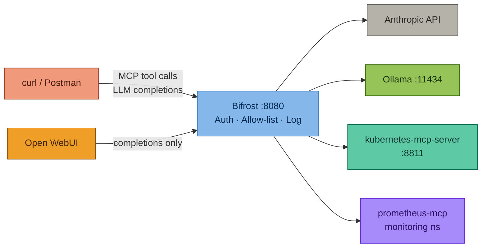
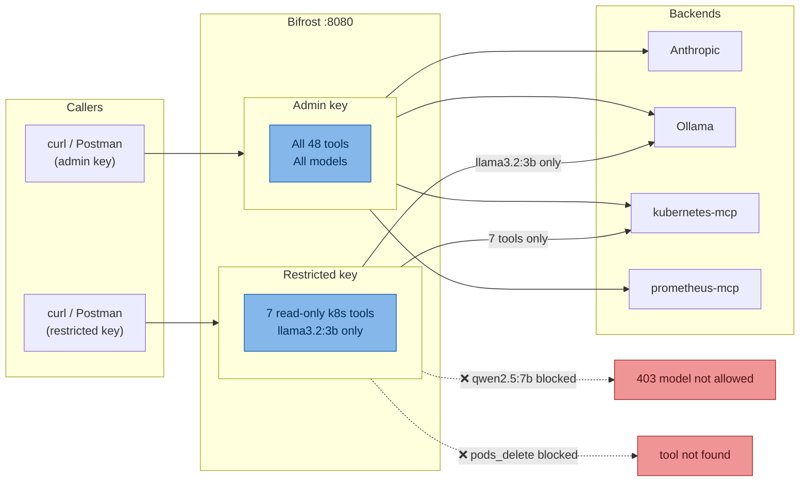

# Bifrost AI Gateway — Local Cluster Demo

A complete demo environment for [Bifrost AI Gateway](https://github.com/maximhq/bifrost) on a local kind cluster, including Kubernetes MCP tool integration, Prometheus MCP observability, Ollama local model support, and governed agentic workflows.

## What This Repo Contains

```
bifrost-k8s-demo
├── docs
│   ├── Additional-MCP-Server-Guides
│   │   ├── Argo CD MCP Server — Deployment Guide.md
│   │   ├── AWS MCP Server — Deployment & Demo Guide.md
│   │   ├── Azure MCP Server — Deployment & Demo Guide.md
│   │   ├── Datadog MCP Server — Deployment & Demo Guide.md
│   │   ├── Dynatrace MCP Server — Deployment & Demo Guide.md
│   │   ├── GitHub MCP Server — Deployment & Demo Guide.md
│   │   └── Grafana MCP Server — Deployment & Demo Guide.md
│   ├── bifrost-analysis.md
│   ├── BIFROST_METRICS_QUERY_REFERENCE.md
│   ├── bifrost-mcp-quickref.md
│   ├── bifrost-mcp-rebuild-guide.md
│   ├── demo-guide.md
│   ├── gateway-comparison.md
│   ├── network-flow.svg
│   ├── ollama-bifrost-setup.md
│   ├── Prometheus MCP Server — Deployment & Demo Guide.md
│   ├── prometheus-grafana-bifrost.md
│   ├── README.md
│   ├── SERVICEMONITOR_DEBUG_QUICK_REF.md
│   ├── SESSION_RECAP_2026-05-12-prometheus-bifrost-fix.md
│   └── screenshots
│       ├── access-denied-delete-pod.png
│       ├── bifrost-access-control.png
│       ├── bifrost-dashboard.png
│       ├── bifrost-latency-p99.png
│       ├── bifrost-llm-logs.png
│       ├── bifrost-logs.png
│       ├── bifrost-mcp-catalog.png
│       ├── bifrost-total-requests.png
│       ├── cpu-usage-by-pod.png
│       ├── instant-query-up-targets.png
│       ├── owui-basic-chat.png
│       ├── owui-gemma4-triage-response.png
│       ├── owui-model-comparison.png
│       ├── owui-model-selector.png
│       ├── pods-in-namespace-restricted.png
│       └── prometheus-mcp-running.png
├── grafana-dashboards
│   ├── advanced-bifrost-grafana-dashboard.json
│   └── bifrost-grafana-dashboard.json
├── manifests
│   ├── bifrost-alerts.yaml
│   ├── bifrost-config.json
│   ├── bifrost-servicemonitor.yaml
│   ├── bifrost-values-dev.yaml
│   ├── bifrost-values-prod.yaml
│   ├── mcp-kubernetes-host-svc.yaml
│   ├── mcp-kubernetes-proxy-kind.yaml
│   ├── namespace.yaml
│   ├── prometheus-mcp-deployment-fixed.yaml
│   └── prometheus-mcp.yaml
├── postman
│   └── bifrost-k8s-mcp_postman_collection.json
├── README.md
└── scripts
    ├── bifrost-sim.sh
    ├── com.local.mcp-kubernetes-sse.plist
    ├── install.sh
    ├── start-mcp-server.sh
    ├── teardown.sh
    ├── test-prometheus-connectivity.sh
    └── warmup-ollama.sh
```

## Prerequisites

- kind cluster running (`kind-devops-lab`)
- Helm 3.x
- kubectl configured for the cluster
- Anthropic API key
- Ollama installed on Mac (`brew install ollama`) with `OLLAMA_HOST=0.0.0.0`
- Docker Desktop for Mac

## Quick Start

```bash
# 1. Clone the repo
git clone https://github.com/simonjday/bifrost-k8s-demo.git
cd bifrost-k8s-demo

# 2. Run the install script
./scripts/install.sh --apply --context kind-devops-lab

# 3. Install the kubernetes MCP server LaunchAgent
cp scripts/com.local.mcp-kubernetes-sse.plist ~/Library/LaunchAgents/
launchctl load -w ~/Library/LaunchAgents/com.local.mcp-kubernetes-sse.plist

# 4. Start port-forwards
kubectl -n ai-gateway port-forward svc/bifrost 8080:8080 &
kubectl -n monitoring port-forward svc/kube-prometheus-stack-prometheus 9090:9090 &
kubectl -n monitoring port-forward svc/kube-prometheus-stack-grafana 3000:80 &
kubectl -n argocd port-forward svc/argocd-server 9080:80 &

# 5. Export your virtual keys (get from http://localhost:8080 → Keys)
export KEY_ALL="<your-admin-key>"
export KEY_RESTRICTED="<your-restricted-key>"

# 6. Verify both MCP servers are connected (should show 48 total tools)
curl -s -X POST http://localhost:8080/mcp \
  -H "Content-Type: application/json" \
  -H "X-Api-Key: $KEY_ALL" \
  -d '{"jsonrpc":"2.0","id":1,"method":"tools/list","params":{}}' \
  | jq '[.result.tools[].name] | group_by(split("-")[0]) | map({prefix: .[0] | split("-")[0], count: length})'
# Expected: new_kubernetes_local: 20, prometheus: 28
```

After running the install script, both MCP servers are configured. Verify they're connected:

```bash
curl -s http://localhost:8080/api/mcp/clients | jq '.clients[] | {name, state, tool_count: (.tools | length)}'
# Expected: 2 clients, both "connected", 20 + 28 tools
```

**MCP Server Details:**

| Server | Type | URL | Tools | Notes |
|---|---|---|---|---|
| `kubernetes-local` | SSE | `http://mcp-kubernetes-sse.ai-gateway.svc.cluster.local:8811/sse` | 20 | Via socat proxy in-cluster to Mac (192.168.1.21:8811) |
| `prometheus` | HTTP (Streamable) | `http://prometheus-mcp.monitoring.svc.cluster.local:8080/mcp` | 28 | In-cluster service, scrapes Prometheus API |

> **Kubernetes MCP Networking:** The `mcp-kubernetes-proxy` Deployment (socat) forwards requests from in-cluster DNS to the Mac LaunchAgent. This allows Bifrost to reach the Mac MCP server without exposing it to the network.

> After setup, go to **Bifrost UI → Virtual Keys** and explicitly grant access to each MCP server for each key that needs it.

---

## Architecture

### MCP Servers

Two MCP servers are registered with Bifrost, providing 48 tools in total:

| Server | Tools | Connection | Prefix |
|---|---|---|---|
| `new_kubernetes_local` | 20 | SSE → `http://192.168.1.21:8811/sse` | `new_kubernetes_local-` |
| `prometheus` | 28 | HTTP (Streamable) → in-cluster `:8080/mcp` | `prometheus-` |

### Request Routing



### kind Cluster Networking

```
Mac Host
├── Ollama (0.0.0.0:11434)
├── kubernetes-mcp-server LaunchAgent (:8811)
│
└── Docker Desktop / kind cluster
    ├── ai-gateway namespace
    │   ├── bifrost-0 (:8080)
    │   │   ├── → Ollama: 192.168.1.21:11434
    │   │   ├── → Kubernetes MCP: http://mcp-kubernetes-sse.ai-gateway.svc.cluster.local:8811/sse
    │   │   └── → Prometheus: http://prometheus-mcp.monitoring.svc.cluster.local:8080/mcp
    │   └── mcp-kubernetes-proxy (socat) 
    │       └── Forwards to Mac: 192.168.1.21:8811
    │
    └── monitoring namespace
        ├── kube-prometheus-stack (Prometheus + Grafana)
        └── prometheus-mcp (:8080)
            └── Wraps prometheus-mcp-server, makes Prometheus API available as MCP tools
```

**Key networking details:**
- Bifrost inside kind **cannot** use `localhost` — must use Mac's LAN IP (`192.168.1.21`) for Ollama/MCP server
- Ollama is reachable via Docker Desktop gateway (`192.168.65.254:11434`), **not** Mac LAN IP
- In-cluster services resolved via DNS (e.g., `prometheus-mcp.monitoring.svc.cluster.local`)

---

## Postman Collection

The Postman collection (`postman/bifrost-k8s-mcp_postman_collection.json`) includes **10 Bifrost metric queries**:

### 🔮 Bifrost — Gateway Metrics (5 queries via MCP)
These queries call Bifrost's MCP interface. Due to a hard-coded timeout in the Prometheus MCP server binary (v0.18.0), these may timeout after pod restarts (see **Known Issues** below).

- **All Bifrost metrics (instant)** — `bifrost_success_requests_total`
- **Request rate by provider (5m)** — `rate(bifrost_success_requests_total[5m])`
- **Error rate by provider (5m)** — `bifrost_error_requests_total`
- **P95 latency by model (5m)** — Latency percentiles by model
- **Token throughput (5m)** — `bifrost_output_tokens_total`

### 🔧 Direct Prometheus Queries (5 queries — RECOMMENDED FOR STABILITY)
These queries call Prometheus directly via HTTP API, **bypassing the MCP interface entirely**. These are always stable and never timeout.

- **All Bifrost Metrics (Instant)** — `bifrost_success_requests_total`
- **Bifrost Errors (Instant)** — `bifrost_error_requests_total`
- **Success Rate by Provider (5m avg)** — `rate(bifrost_success_requests_total[5m])`
- **Token Throughput (5m)** — `rate(bifrost_output_tokens_total[5m])`
- **Range Query: Requests Over Time (1h)** — Time series with visualizations

All queries include **working visualizations** that parse response data and display metrics in tables.

---

## Testing & Metrics

Generate synthetic traffic through Bifrost to populate Prometheus metrics:

```bash
bash scripts/bifrost-sim.sh        # 40 requests (default)
bash scripts/bifrost-sim.sh 100    # custom count
```

Rotates across `llama3.2:3b` and `qwen2.5-coder:7b`. Wait ~30 seconds after completion for Prometheus to scrape, then run the 🔧 **Direct Prometheus Queries** folder in Postman.


---

## Open WebUI

All local Ollama models are accessible through a real chat interface via [Open WebUI](https://github.com/open-webui/open-webui). Every message routes through Bifrost — nothing leaves the machine.

```bash
docker run -d \
  --name open-webui \
  -p 3001:8080 \
  -e OPENAI_API_BASE_URL=http://host.docker.internal:8080/v1 \
  -e OPENAI_API_KEY=$KEY_ALL \
  -v open-webui:/app/backend/data \
  --restart always \
  ghcr.io/open-webui/open-webui:main
```

Open `http://localhost:3001`. Port `3000` is reserved by Grafana.

> Use `host.docker.internal` (not `localhost`) — this resolves to the Mac host from inside Docker, routing traffic through Bifrost correctly.

---

## Virtual Key Model




---

## After Restarting the kind Cluster

The kind API server port changes on every cluster restart. Restart the LaunchAgent to reload the kubeconfig:

```bash
# 1. Restart the LaunchAgent
launchctl stop com.local.mcp-kubernetes-sse
launchctl start com.local.mcp-kubernetes-sse

# 2. Re-apply port-forwards
kubectl -n ai-gateway port-forward svc/bifrost 8080:8080 &
kubectl -n monitoring port-forward svc/kube-prometheus-stack-prometheus 9090:9090 &
kubectl -n monitoring port-forward svc/kube-prometheus-stack-grafana 3000:80 &

# 3. Verify
curl -s -X POST http://localhost:8080/mcp \
  -H "Content-Type: application/json" \
  -H "X-Api-Key: $KEY_ALL" \
  -d '{"jsonrpc":"2.0","id":1,"method":"tools/list","params":{}}' \
  | jq '[.result.tools[].name] | length'
# Expected: 48
```

---

## Known Gotchas

| Issue | Fix |
|---|---|
| `install.sh` fails: "command not found: kubectl --context kind-devops-lab" | Use fixed version from repo — kubectl_cmd() function replaces string variable. Handles word-splitting in conditionals properly |
| Helm release stuck: "cannot reuse a name that is still in use" | `helm uninstall bifrost -n ai-gateway` before re-running install script |
| Prometheus MCP `listen tcp :8080: bind: address already in use` | Manifest args are malformed. Must use `command: ["node"]` entry point with proper args array (no shell string). See manifests/prometheus-mcp-deployment-fixed.yaml |
| Prometheus MCP pod stuck initializing | Supergateway expects stateless HTTP transport. Ensure deployment uses `--outputTransport streamableHttp` and `--web.listen-address=:0` (random port for Prometheus binary). Remove health probes. |
| **Prometheus MCP server exits after ~5 seconds (KNOWN LIMITATION)** | **Hard-coded timeout in prometheus-mcp-server binary (v0.18.0).** Workaround: Use **Direct Prometheus Queries** folder in Postman (bypasses MCP interface entirely). Direct curl to Prometheus also works: `curl -s 'http://localhost:9090/api/v1/query?query=bifrost_success_requests_total'` |
| Prometheus not scraping Bifrost (ServiceMonitor "No active targets") | ServiceMonitor selector must match **service labels**, not pod labels. Fix: `selector: {matchLabels: {app.kubernetes.io/name: bifrost}}` and label `release: kube-prometheus-stack`. See [ServiceMonitor Debug Quick Ref](docs/SERVICEMONITOR_DEBUG_QUICK_REF.md) |
| Bifrost metrics not appearing in Prometheus | After fixing ServiceMonitor selector, restart Prometheus: `kubectl -n monitoring delete pod prometheus-kube-prometheus-stack-prometheus-0`. Wait 30s for scrape. Query test: `curl -s 'http://localhost:9090/api/v1/query?query=bifrost_success_requests_total'` |
| prometheus tools return 0 after Bifrost restart | Key permission cache is stale. Bifrost UI → Virtual Keys → toggle **Is this key active?** OFF for 3s, then ON |
| Bifrost can't reach MCP servers in-cluster | Test from Bifrost pod: `kubectl -n ai-gateway exec bifrost-0 -- wget -v http://mcp-kubernetes-sse.ai-gateway.svc.cluster.local:8811/healthz`. Verify socat proxy is running: `kubectl -n ai-gateway get pods -l app=mcp-kubernetes-proxy` |
| MCP clients show as `null` name in Bifrost | They're still functional; name field is for UI labels. Explicitly set server names in Bifrost config JSON if desired |
| Tool not found | Use correct prefix: `new_kubernetes_local-` (not `kubernetes_local-`), `prometheus-`. Run `tools/list` to confirm exact names |
| Ollama `403 Model is not allowed` | Allowed Keys empty in virtual key config — select provider key explicitly in Bifrost UI |
| Ollama `404 page not found` | Wrong provider type (`ollama` instead of `openai`) or `/v1` in base URL — remove it |
| `qwen2.5-coder:1.5b-base` returns 400 | Base model — no chat completions support. Use `qwen2.5-coder:7b` instead |
| Open WebUI shows no models | `OPENAI_API_BASE_URL` must point at Bifrost (`:8080`), not Ollama (`:11434`) |
| Anthropic `429 rate_limit_error` | Tool schemas consume large token budget — use `claude-haiku-4-5-20251001` for MCP tool flows |
| Agent mode not executing tools | Set **Tools to Auto Execute: `*`** in Bifrost UI → MCP → `kubernetes-local` → Edit |

---

## Key Configuration Reference

| Item | Value |
|---|---|
| Bifrost UI | `http://localhost:8080` |
| Bifrost completions | `POST http://localhost:8080/v1/chat/completions` |
| Bifrost MCP endpoint | `POST http://localhost:8080/mcp` |
| Auth header | `X-Api-Key: $KEY_ALL` |
| Kubernetes MCP tool prefix | `new_kubernetes_local-<tool>` |
| Prometheus MCP tool prefix | `prometheus-<tool>` |
| Ollama model prefix | `openai/<modelname>` e.g. `openai/qwen2.5:7b` |
| Ollama provider type | `openai` (NOT `ollama`) |
| Ollama base URL (kind) | `http://192.168.1.21:11434` (no `/v1` suffix) |
| Kubernetes MCP SSE URL | `http://192.168.1.21:8811/sse` |
| Prometheus MCP URL | `http://prometheus-mcp.monitoring.svc.cluster.local:8080/mcp` |
| Prometheus UI | `http://localhost:9090` |
| Grafana | `http://localhost:3000` |
| ArgoCD | `http://localhost:9080` |
| Open WebUI | `http://localhost:3001` |
| x-bf-mcp-include-clients | `new_kubernetes_local` (agentic mode header) |

---

## Validated Environment

| Component | Version / Detail |
|---|---|
| Bifrost | v1.5.0 |
| install.sh | kubectl_cmd() function, auto-config MCP servers |
| kubernetes-mcp-server | latest (macOS LaunchAgent, port 8811) |
| prometheus-mcp-server | v0.18.0 (ghcr.io/tjhop/prometheus-mcp-server) with HTTP transport |
| Kubernetes | v1.33.x (kind-devops-lab) |
| Docker Desktop | Mac (LAN IP: 192.168.1.21) |
| kube-prometheus-stack | latest (Helm, Prometheus + Grafana) |
| Metrics Server | installed by install.sh, required for pods_top |
| ServiceMonitor | bifrost (15s interval, scrapes :8080/metrics) |
| PrometheusRule | bifrost (5 alert rules for gateway health) |
| Ollama models | qwen2.5:7b, qwen3-coder:30b, llama3.2:3b, qwen2.5-coder:7b, gemma4:latest |
| Anthropic models | claude-haiku-4-5-20251001, claude-sonnet-4-5-20250929 |
| Open WebUI | latest (ghcr.io/open-webui/open-webui:main) |

---

## Docs

| Doc | Purpose |
|---|---|
| [docs/demo-guide.md](docs/demo-guide.md) | Primary demo playbook — 11 demos |
| [docs/bifrost-mcp-rebuild-guide.md](docs/bifrost-mcp-rebuild-guide.md) | Step-by-step guide for full cluster rebuild, Bifrost install, observability, and MCP setup |
| [docs/bifrost-mcp-quickref.md](docs/bifrost-mcp-quickref.md) | Quick reference, health checks, troubleshooting, and common debugging commands |
| [docs/BIFROST_METRICS_QUERY_REFERENCE.md](docs/BIFROST_METRICS_QUERY_REFERENCE.md) | **[NEW]** All Bifrost metrics and example PromQL queries |
| [docs/SERVICEMONITOR_DEBUG_QUICK_REF.md](docs/SERVICEMONITOR_DEBUG_QUICK_REF.md) | **[NEW]** ServiceMonitor troubleshooting and debug checklist |
| [docs/SESSION_RECAP_2026-05-12-prometheus-bifrost-fix.md](docs/SESSION_RECAP_2026-05-12-prometheus-bifrost-fix.md) | **[NEW]** This session's Prometheus integration fixes and root cause analysis |
| [docs/Prometheus MCP Server — Deployment & Demo Guide.md](docs/Prometheus%20MCP%20Server%20—%20Deployment%20%26%20Demo%20Guide.md) | Prometheus MCP setup, ServiceMonitor, Postman collection |
| [docs/prometheus-grafana-bifrost.md](docs/prometheus-grafana-bifrost.md) | Bifrost metrics in Prometheus & Grafana — ServiceMonitor, dashboard import, PromQL reference |
| [docs/ollama-bifrost-setup.md](docs/ollama-bifrost-setup.md) | Ollama config, model management, Claude Desktop integration |
| [docs/bifrost-analysis.md](docs/bifrost-analysis.md) | Bifrost vendor analysis, test scenarios |
| [docs/gateway-comparison.md](docs/gateway-comparison.md) | Bifrost vs LiteLLM vs Portkey vs Kong vs Helicone |
| [docs/Additional-MCP-Server-Guides/](docs/Additional-MCP-Server-Guides/) | Setup guides for ArgoCD, AWS, Azure, Datadog, Dynatrace, GitHub, Grafana MCP servers |

---

**Last Updated:** May 12, 2026 — Prometheus Integration, Stability Notes, and Direct Query Workarounds
