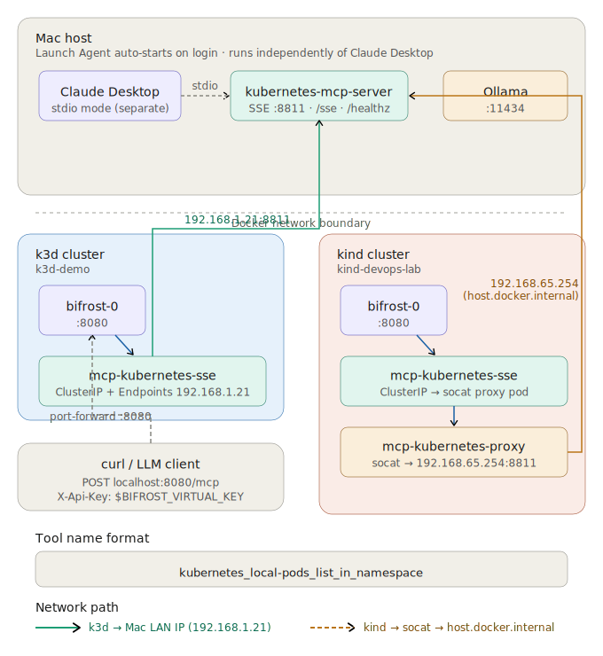

# Bifrost AI Gateway — k3d Demo

A complete demo environment for [Bifrost AI Gateway](https://github.com/maximhq/bifrost) on a local k3d cluster, including Kubernetes MCP tool integration, Ollama local model support, and governed agentic workflows.

## What This Repo Contains

```
bifrost-k8s-demo/
├── README.md                                  # This file
├── docs/
│   └── network-flow.svg                           # MCP network flow diagram (k3d + kind)

│   ├── demo-guide.md                          # Complete demo playbook (10 demos, pre-reqs, curl commands)
│   └── gateway-comparison.md                  # Bifrost vs LiteLLM vs Portkey vs Kong vs Helicone
├── manifests/
│   ├── namespace.yaml                         # ai-gateway namespace
│   ├── bifrost-values-dev.yaml                # Helm values for local k3d dev install
│   ├── bifrost-values-prod.yaml               # Helm values for production HA install
│   ├── mcp-kubernetes-host-svc.yaml           # Service + Endpoints for k3d (Mac LAN IP)
│   └── mcp-kubernetes-proxy-kind.yaml         # socat proxy Deployment + Service for kind
├── scripts/
│   ├── install.sh                             # Full install: Bifrost + MCP + providers
│   ├── teardown.sh                            # Clean teardown (dry-run by default)
│   ├── start-mcp-server.sh                    # One-shot: apply k8s svc + start SSE server
│   ├── com.local.mcp-kubernetes-sse.plist     # macOS Launch Agent for kubernetes-mcp-server
│   └── warmup-ollama.sh                       # Pre-warm Ollama models before demo
└── demos/
    ├── 01-governance-block.sh                 # Demo 5: Destructive tool blocking
    ├── 02-cost-attribution.sh                 # Demo 2: Namespace resource consumption
    ├── 03-crashloop-diagnosis.sh              # Demo 3: Pod diagnosis workflow
    ├── 04-argocd-status.sh                    # Demo 4: Argo CD CRD queries
    ├── 05-kargo-pipeline.sh                   # Demo 6: Kargo stage and freight status
    ├── 06-lm-triage.sh                        # Demo 7: LLM-driven cluster triage (agent mode)
    ├── 07-multi-tool-correlation.sh           # Demo 8: Pods + Argo CD + Kargo correlation
    ├── 08-local-vs-cloud.sh                   # Demo 9: Ollama vs Anthropic comparison
    └── 09-ollama-fast-query.sh                # Demo 10: Sub-2s local model query
```

## Prerequisites

- k3d or kind cluster running
- Helm 3.x
- kubectl configured for the cluster
- Anthropic API key
- Ollama installed on Mac (`brew install ollama`)
- Node.js 18+ / npx (for `kubernetes-mcp-server`)
- Docker Desktop for Mac

## Quick Start

```bash
# 1. Clone the repo
git clone https://github.com/simonjday/bifrost-k8s-demo.git
cd bifrost-k8s-demo

# 2. Run the install script (auto-detects k3d vs kind)
./scripts/install.sh --apply
# Or target a specific context:
./scripts/install.sh --apply --context kind-devops-lab

# 3. Install the MCP server Launch Agent (runs automatically on login)
cp scripts/com.local.mcp-kubernetes-sse.plist ~/Library/LaunchAgents/
launchctl load -w ~/Library/LaunchAgents/com.local.mcp-kubernetes-sse.plist

# 4. Port-forward Bifrost
kubectl port-forward -n ai-gateway svc/bifrost 8080:8080 &

# 5. Register the MCP server in Bifrost UI → MCP → New MCP Server:
#   Name:            kubernetes_local
#   Connection Type: Server-Sent Events (SSE)
#   URL:             http://mcp-kubernetes-sse.ai-gateway.svc.cluster.local:8811/sse
#   Auth:            None

# 6. Verify Bifrost is connected (should show state: connected, tool_count: 20)
curl -s http://localhost:8080/api/mcp/clients | \
  jq '{state: .clients[0].state, tool_count: (.clients[0].tools | length)}'

# 7. Export your Bifrost virtual key (get from http://localhost:8080 → Keys)
export BIFROST_VIRTUAL_KEY="vk_your_key_here"

# 8. Run any demo
./demos/01-governance-block.sh
```

## Architecture

### k3d
```
Mac Host
├── Ollama (0.0.0.0:11434) ──────────────────────────────────┐
├── kubernetes-mcp-server SSE (0.0.0.0:8811) ────────────────┐│
│   └── macOS Launch Agent (auto-start/restart on login)      ││
│                                                              ││
└── k3d cluster (Docker)                                       ││
    └── ai-gateway namespace                                   ││
        ├── bifrost-0 → localhost:8080 (port-forward)          ││
        ├── mcp-kubernetes-sse Service                         ││
        │   └── Endpoints: 192.168.1.21:8811 ────────────────►┘│
        │       (Mac LAN IP — directly reachable from k3d)      │
        └── openai provider → 192.168.1.21:11434 ─────────────►┘
```

### kind
```
Mac Host
├── Ollama (0.0.0.0:11434) ──────────────────────────────────┐
├── kubernetes-mcp-server SSE (0.0.0.0:8811) ────────────────┐│
│   └── macOS Launch Agent (auto-start/restart on login)      ││
│                                                              ││
└── kind cluster (Docker)                                      ││
    └── ai-gateway namespace                                   ││
        ├── bifrost-0 → localhost:8080 (port-forward)          ││
        ├── mcp-kubernetes-sse Service                         ││
        │   └── mcp-kubernetes-proxy pod (socat)               ││
        │       └── 192.168.65.254:8811 ──────────────────────►┘│
        │           (Docker host gateway — reachable from kind)  │
        └── openai provider → 192.168.65.254:11434 ────────────►┘
```

## Network Flow



The diagram above shows the full request path for both cluster types:

- **k3d** — Bifrost pod → `mcp-kubernetes-sse` Service → Endpoints (`192.168.1.21`) → Mac MCP server. k3d pods can reach the Mac's LAN IP directly via the Docker bridge.
- **kind** — Bifrost pod → `mcp-kubernetes-sse` Service → `mcp-kubernetes-proxy` pod (socat) → `192.168.65.254` (`host.docker.internal`) → Mac MCP server. kind pods cannot reach the Mac LAN IP so traffic is proxied.
- **Claude Desktop** uses a separate stdio instance of `kubernetes-mcp-server` — independent of the SSE server above.
- **curl / LLM clients** reach Bifrost via `kubectl port-forward` on `localhost:8080`.

## MCP Server — Launch Agent Setup

The `kubernetes-mcp-server` runs as a macOS Launch Agent so it starts automatically
at login and restarts on crash. It exposes `/sse`, `/mcp`, `/healthz` on port 8811.

### Install (one-time)

```bash
# 1. Install the Launch Agent
cp scripts/com.local.mcp-kubernetes-sse.plist ~/Library/LaunchAgents/
launchctl load -w ~/Library/LaunchAgents/com.local.mcp-kubernetes-sse.plist

# 2. Verify it's running
lsof -i :8811 | grep LISTEN       # should show *:8811 (LISTEN)
curl -s http://localhost:8811/healthz && echo OK

# 3. Apply k8s networking (install.sh does this automatically)
# k3d:
kubectl apply -f manifests/mcp-kubernetes-host-svc.yaml
# kind:
kubectl apply -f manifests/mcp-kubernetes-proxy-kind.yaml

# 4. Verify end-to-end
kubectl exec -n ai-gateway bifrost-0 -- \
  wget -qO- http://mcp-kubernetes-sse.ai-gateway.svc.cluster.local:8811/healthz \
  && echo "In-cluster: OK"
```

### Logs

```bash
tail -f /tmp/mcp-kubernetes-sse.log   # stdout
tail -f /tmp/mcp-kubernetes-sse.err   # stderr / errors
```

### Manage

```bash
# Stop (stays installed, restarts on next login)
launchctl stop com.local.mcp-kubernetes-sse

# Reload after editing the plist
launchctl unload ~/Library/LaunchAgents/com.local.mcp-kubernetes-sse.plist
launchctl load -w ~/Library/LaunchAgents/com.local.mcp-kubernetes-sse.plist

# Uninstall completely
launchctl unload ~/Library/LaunchAgents/com.local.mcp-kubernetes-sse.plist
rm ~/Library/LaunchAgents/com.local.mcp-kubernetes-sse.plist
```

## Testing the MCP Integration

### Check Bifrost client state

```bash
curl -s http://localhost:8080/api/mcp/clients | \
  jq '{state: .clients[0].state, tool_count: (.clients[0].tools | length)}'
# Expected: { "state": "connected", "tool_count": 20 }
```

### Discover available tools

```bash
# Always run this first — tool names include the client prefix
curl -s -X POST http://localhost:8080/mcp \
  -H "Content-Type: application/json" \
  -H "X-Api-Key: $BIFROST_VIRTUAL_KEY" \
  -d '{"jsonrpc":"2.0","id":1,"method":"tools/list","params":{}}' \
  | jq '[.result.tools[].name]'
```

### Call a tool via Bifrost MCP endpoint

```bash
curl -s -X POST http://localhost:8080/mcp \
  -H "Content-Type: application/json" \
  -H "X-Api-Key: $BIFROST_VIRTUAL_KEY" \
  -d '{
    "jsonrpc": "2.0",
    "id": 1,
    "method": "tools/call",
    "params": {
      "name": "kubernetes_local-pods_list_in_namespace",
      "arguments": {
        "namespace": "ai-gateway"
      }
    }
  }'
```

### Via LLM (agentic mode)

```bash
curl -s -X POST http://localhost:8080/v1/chat/completions \
  -H "Content-Type: application/json" \
  -H "X-Api-Key: $BIFROST_VIRTUAL_KEY" \
  -d '{
    "model": "anthropic/claude-sonnet-4-5-20250929",
    "messages": [{"role": "user", "content": "List all pods in the ai-gateway namespace"}],
    "tools": "mcp::kubernetes_local"
  }'
```

## Key Configuration Facts

| Item | Value |
|---|---|
| Bifrost UI | http://localhost:8080 (via port-forward) |
| MCP JSON-RPC endpoint | `POST http://localhost:8080/mcp` |
| Completions endpoint | `POST http://localhost:8080/v1/chat/completions` |
| Auth header | `X-Api-Key: $BIFROST_VIRTUAL_KEY` |
| MCP tool name format | `kubernetes_local-<tool_name>` (underscore, then hyphen) |
| Anthropic model | `anthropic/claude-sonnet-4-5-20250929` |
| Ollama model prefix | `openai/<modelname>` e.g. `openai/qwen2.5:7b` |
| Ollama provider type | `openai` (NOT `ollama`) |
| Ollama base URL (k3d) | `http://192.168.1.21:11434` (no `/v1` suffix) |
| Ollama base URL (kind) | `http://192.168.65.254:11434` (no `/v1` suffix) |
| MCP SSE URL (in-cluster) | `http://mcp-kubernetes-sse.ai-gateway.svc.cluster.local:8811/sse` |
| MCP SSE URL (local) | `http://localhost:8811/sse` |

## After Restarting the kind Cluster

The kind API server port is dynamic and changes on every cluster restart. Both the
Launch Agent SSE server and Claude Desktop cache the kubeconfig at startup — they must
be restarted whenever kind is stopped and restarted.

```bash
# 1. Restart the Launch Agent (reloads kubeconfig with new API port)
launchctl stop com.local.mcp-kubernetes-sse
launchctl start com.local.mcp-kubernetes-sse

# 2. Restart Claude Desktop (reloads its stdio MCP instance)
osascript -e 'quit app "Claude"'
sleep 3
open -a Claude

# 3. Re-apply port-forward
kubectl --context kind-devops-lab port-forward -n ai-gateway svc/bifrost 8080:8080 &

# 4. Verify everything is healthy
curl -s http://localhost:8080/api/mcp/clients | jq '{state: .clients[0].state, tool_count: (.clients[0].tools | length)}'
```

## Known Gotchas

- **Restart Launch Agent + Claude Desktop after kind cluster restart** — the kind API
  server port changes on every restart. Both processes cache kubeconfig at startup and
  will fail with `RESOURCE_NOT_FOUND` errors until restarted. See "After Restarting
  the kind Cluster" above.
- **`pods_top` fails with `RESOURCE_NOT_FOUND`** — either Metrics Server isn't installed
  (run `./scripts/install.sh --apply`) or the MCP server has a stale kubeconfig (restart
  the Launch Agent). Confirmed working via curl does not mean the Claude Desktop MCP
  instance is also working — they are separate processes.
- **Use single-line curl for MCP calls** — zsh parse errors occur when pasting multi-line
  curl blocks with comments (`#`) inline. Always use single-line format:
  `curl -s -X POST ... -d '{"jsonrpc":"2.0",...}'`
- **Tool name format is `kubernetes_local-<tool>`** — underscore in client name, hyphen
  separator. Use `tools/list` to discover exact names before calling.
- **No `x-bf-mcp-include-clients` header needed** — tool names are prefixed so Bifrost
  routes automatically. The header is only needed if tools are unprefixed.
- **Use port 8080 always** — only run one cluster at a time and port-forward to 8080.
- **`state: null` from curl** — means no port-forward is running. Check with `lsof -i :8080`.
- **k3d uses Mac LAN IP (`192.168.1.21`)** — kind cannot reach this, uses socat proxy instead.
- **kind: never create manual EndpointSlices** — they conflict with the controller-managed
  one and break kube-proxy. Delete with `kubectl delete endpointslice mcp-kubernetes-sse -n ai-gateway`.
- **`--port` flag only, no `--transport`** — `ENABLE_UNSAFE_SSE_TRANSPORT=1` env var required.
- **Claude Desktop runs its own stdio instance** — separate from the SSE Launch Agent, do not
  change `claude_desktop_config.json`.
- Helm install issues (Kyverno label enforcement, encryption key secret, stale releases)
- Ollama provider registration (use `openai` type, no `/v1` in base URL)
- Agent mode: `tools_to_auto_execute` set on MCP client in Bifrost UI, not a request header

## Validated Environment

| Component | Version |
|---|---|
| Bifrost | v1.5.0-prerelease7 (chart 2.1.13) |
| kubernetes-mcp-server | latest (Red Hat/containers) |
| k3d cluster | k3d-demo, k3s v1.33.x |
| kind cluster | kind-devops-lab, k8s v1.33.x |
| Docker Desktop | Mac (kind host gateway: 192.168.65.254) |
| Ollama models | qwen2.5:7b, qwen3-coder:30b, llama3.2:3b, qwen2.5-coder:7b, gemma4:latest |
| Anthropic | claude-sonnet-4-5-20250929 |

## Docs

- [Bifrost In-Depth Analysis](docs/bifrost-analysis.md)
- [Demo Guide](docs/demo-guide.md)
- [AI Gateway Comparison](docs/gateway-comparison.md)
