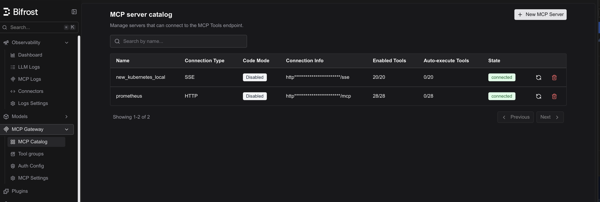
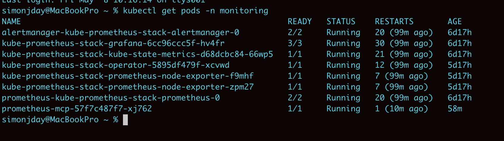
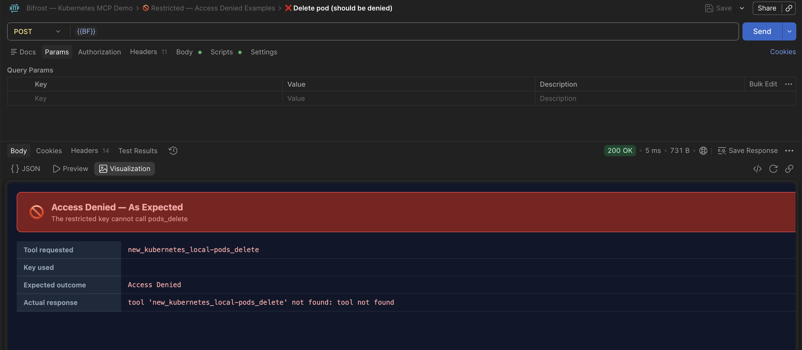
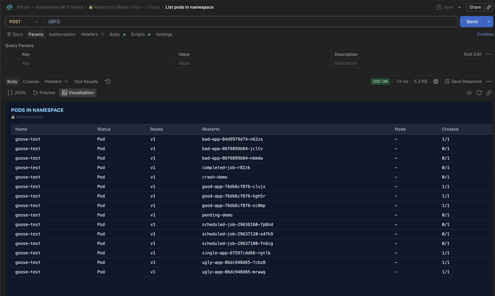
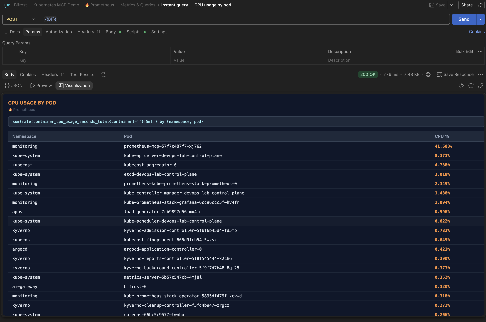
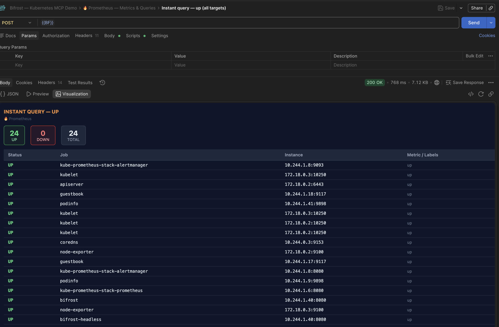
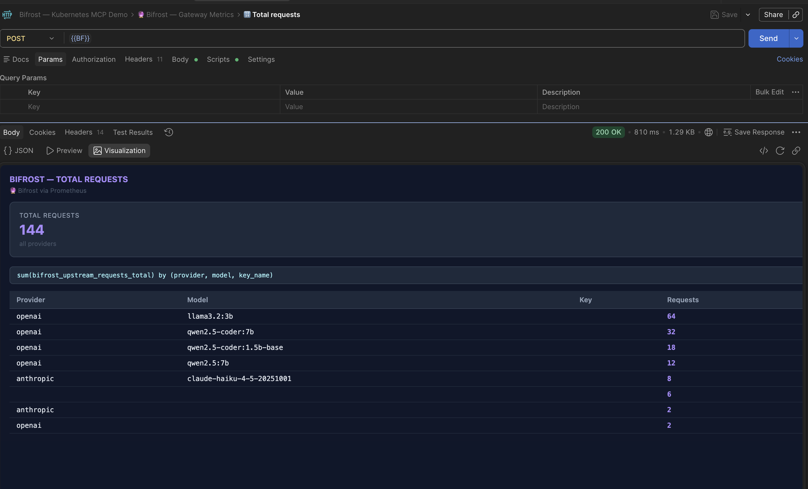
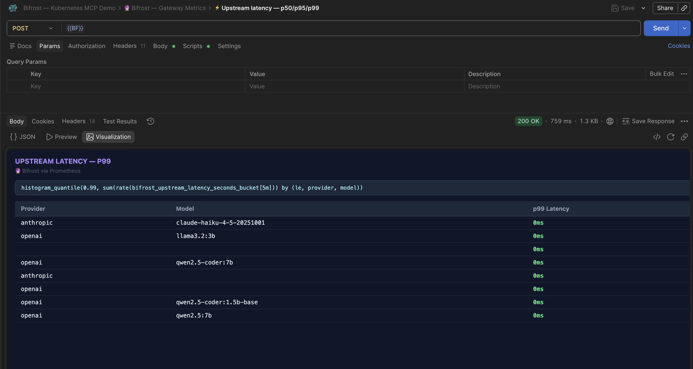
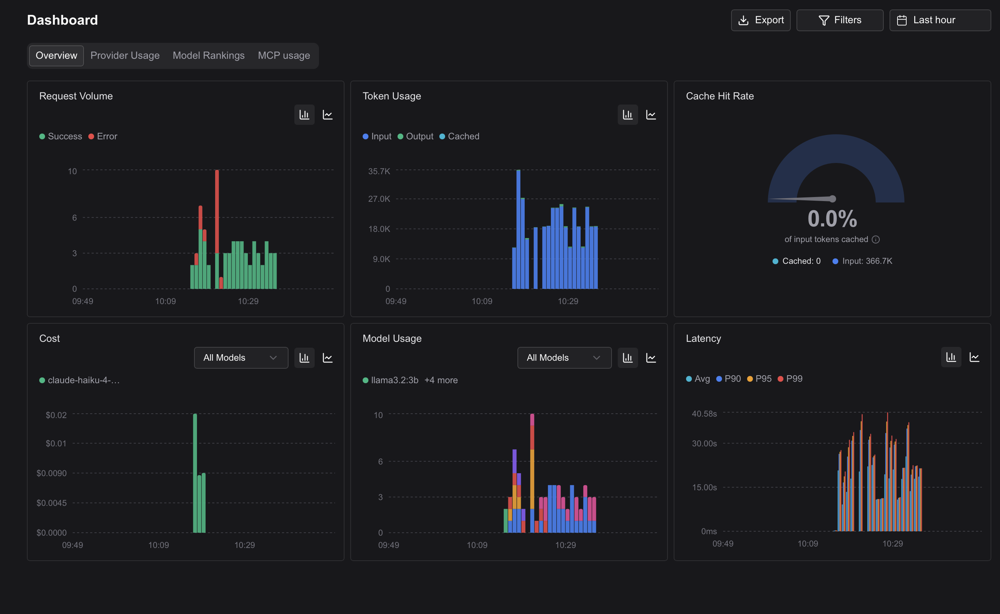
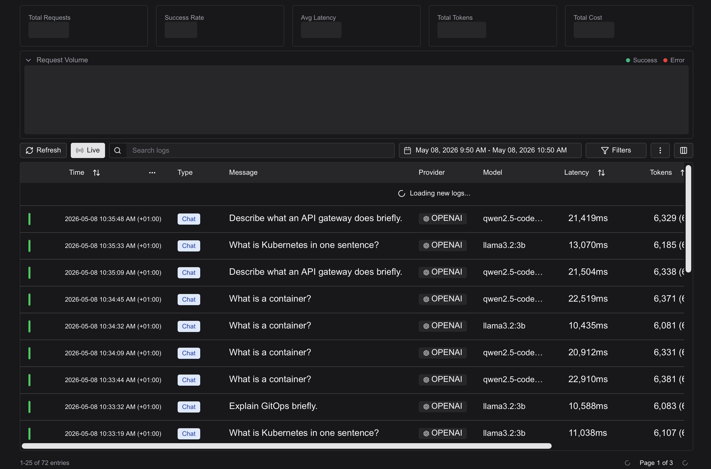

# Query Your Kubernetes Cluster and LLM Metrics from a Single MCP Interface

This guide documents a reference architecture for connecting [Bifrost](https://github.com/maximhq/bifrost) — an open-source AI gateway — to both a Kubernetes cluster and a Prometheus observability stack through the Model Context Protocol (MCP). The result is a single interface through which an AI agent (or a developer using Postman) can query live cluster state, LLM usage metrics, and infrastructure health without switching between tools.

## What We Are Building

The integration connects three systems:

- **Bifrost** running inside a [kind](https://kind.sigs.k8s.io/) cluster, acting as an AI gateway that routes LLM requests to Anthropic and local Ollama models
- **Two MCP servers** registered with Bifrost — one for Kubernetes operations, one for Prometheus queries — giving Bifrost 48 tools spanning cluster management and metrics
- **kube-prometheus-stack** scraping Bifrost's own `/metrics` endpoint, so LLM usage data (tokens, latency, request rates) flows into the same Prometheus instance being queried through MCP

The end state is a Postman collection of 40 requests that demonstrates role-based access control (a restricted read-only key vs a full admin key), live Kubernetes operations, and live Prometheus queries — all rendered with formatted visualizations.

```
AI Agent / Postman
       │
       ▼
 Bifrost :8080/mcp          ← MCP endpoint (JSON-RPC 2.0)
       │
       ├── new_kubernetes_local (20 tools)
       │         └── kubernetes MCP server (SSE, Mac :8811)
       │                   └── kubectl → kind cluster
       │
       └── prometheus (28 tools)
                 └── prometheus-mcp pod (StreamableHTTP :8080/mcp)
                           └── supergateway → prometheus-mcp-server binary
                                     └── Prometheus HTTP API :9090
```

Bifrost metrics flow in the opposite direction: Prometheus scrapes `bifrost-0:8080/metrics` every 15 seconds via a ServiceMonitor, so LLM gateway telemetry appears alongside cluster metrics in the same Prometheus instance.

---

## Prerequisites

- [kind](https://kind.sigs.k8s.io/) installed locally
- [Helm](https://helm.sh/) for installing kube-prometheus-stack
- [Bifrost](https://github.com/maximhq/bifrost) deployed into the cluster (this repo includes the manifests)
- kubectl configured for the kind cluster
- Postman desktop app (for the collection and visualizations)
- Ollama running locally with `llama3.2:3b` and `qwen2.5-coder:7b` pulled

---

## Architecture Overview

### Cluster Layout

| Component | Namespace | Type | Port |
|---|---|---|---|
| Bifrost | `ai-gateway` | StatefulSet | 8080 |
| Prometheus | `monitoring` | StatefulSet (operator) | 9090 |
| prometheus-mcp | `monitoring` | Deployment | 8080 |
| Grafana | `monitoring` | Deployment | 3000 (NodePort 30300) |
| ArgoCD | `argocd` | Deployment | 9080 |

### MCP Server Registration

Bifrost's MCP catalog supports multiple connection types. This integration uses two:

| Server Name | Connection Type | URL |
|---|---|---|
| `new_kubernetes_local` | Server-Sent Events (SSE) | `http://192.168.1.21:8811/sse` |
| `prometheus` | HTTP (Streamable) | `http://prometheus-mcp.monitoring.svc.cluster.local:8080/mcp` |

The kubernetes MCP server runs as a LaunchAgent on the host Mac, exposed over SSE on port 8811. Bifrost (running inside kind) reaches it via the Mac's LAN IP. The prometheus MCP server runs inside the cluster and is accessed via in-cluster DNS.

> **Note on the kubernetes server name:** The entry is named `new_kubernetes_local` rather than `kubernetes_local` because the original entry had an incorrect SSE URL and could not be edited in Bifrost's UI — a new entry was created with the correct URL. All tool names carry the `new_kubernetes_local-` prefix accordingly.

---

## Part 1 — Kubernetes MCP Server Setup

The kubernetes MCP server (`mcp-server-kubernetes`) runs on the host Mac as a LaunchAgent, serving an SSE endpoint that Bifrost connects to from inside the kind cluster.

### LaunchAgent Configuration

Create `~/Library/LaunchAgents/com.mcp.kubernetes.plist`:

```xml
<?xml version="1.0" encoding="UTF-8"?>
<!DOCTYPE plist PUBLIC "-//Apple//DTD PLIST 1.0//EN" "http://www.apple.com/DTDs/PropertyList-1.0.dtd">
<plist version="1.0">
<dict>
    <key>Label</key>
    <string>com.mcp.kubernetes</string>
    <key>ProgramArguments</key>
    <array>
        <string>/usr/local/bin/mcp-server-kubernetes</string>
        <string>--port</string>
        <string>8811</string>
    </array>
    <key>RunAtLoad</key>
    <true/>
    <key>KeepAlive</key>
    <true/>
    <key>StandardOutPath</key>
    <string>/tmp/mcp-kubernetes.stdout.log</string>
    <key>StandardErrorPath</key>
    <string>/tmp/mcp-kubernetes.stderr.log</string>
</dict>
</plist>
```

Load it:

```bash
launchctl load ~/Library/LaunchAgents/com.mcp.kubernetes.plist
```

Verify it started:

```bash
curl -v --max-time 5 http://localhost:8811/sse
# Expected: event: endpoint
#           data: /sse?sessionId=<uuid>
```

### Verify Reachability from Bifrost

Because Bifrost runs inside kind (Docker), it cannot reach `localhost`. Use the Mac's LAN IP:

```bash
kubectl exec -n ai-gateway bifrost-0 -- \
  wget -qO- http://192.168.1.21:8811/sse --timeout=3 2>&1 | head -3
# Expected: event: endpoint
```

### Add to Bifrost

In the Bifrost UI, go to **MCP Server Catalog → New MCP Server**:

| Field | Value |
|---|---|
| Name | `new_kubernetes_local` |
| Connection Type | Server-Sent Events (SSE) |
| URL | `http://192.168.1.21:8811/sse` |



---

## Part 2 — Prometheus MCP Server Setup

The prometheus MCP server runs inside the cluster. The `prometheus-mcp-server` binary only supports stdio transport, so [supergateway](https://github.com/supercorp-ai/supergateway) wraps it as a streamable HTTP endpoint.

### Why Streamable HTTP

Three transport approaches were evaluated:

| Transport | Result |
|---|---|
| SSE (`--outputTransport sse`) | Sessions disconnect when Bifrost pings time out, crashing the pod |
| Streamable HTTP with `--web.listen-address=:9091` | Port conflict when shell loop restarts child rapidly |
| **Streamable HTTP with `--web.listen-address=:0`** | **Stable — random port prevents conflicts** |

The streamable HTTP transport is also stateless, which means there is no MCP session initialization handshake. This matters because Bifrost does not send `notifications/initialized` before making tool calls — a strict session state machine (as used by the Go MCP SDK) will reject calls until initialization completes.

### Deployment

```bash
kubectl apply -f - <<EOF
apiVersion: apps/v1
kind: Deployment
metadata:
  name: prometheus-mcp
  namespace: monitoring
spec:
  replicas: 1
  selector:
    matchLabels:
      app: prometheus-mcp
  template:
    metadata:
      labels:
        app: prometheus-mcp
    spec:
      initContainers:
      - name: copy-binary
        image: ghcr.io/tjhop/prometheus-mcp-server:latest
        command: ["cp", "/bin/prometheus-mcp-server", "/shared/prometheus-mcp-server"]
        volumeMounts:
        - name: shared
          mountPath: /shared
      containers:
      - name: supergateway
        image: ghcr.io/supercorp-ai/supergateway:latest
        args:
          - --stdio
          - "sh -c 'while true; do /shared/prometheus-mcp-server
              --prometheus.url=http://kube-prometheus-stack-prometheus.monitoring.svc.cluster.local:9090
              --web.listen-address=:0;
              echo Restarting child...; sleep 2; done'"
          - --outputTransport
          - streamableHttp
          - --port
          - "8080"
        ports:
        - containerPort: 8080
        volumeMounts:
        - name: shared
          mountPath: /shared
      volumes:
      - name: shared
        emptyDir: {}
---
apiVersion: v1
kind: Service
metadata:
  name: prometheus-mcp
  namespace: monitoring
spec:
  selector:
    app: prometheus-mcp
  ports:
  - port: 8080
    targetPort: 8080
EOF
```

### Key Design Decisions

**Init container pattern:** The `prometheus-mcp-server` binary is copied from its image into a shared `emptyDir` volume during pod startup. Supergateway then runs the binary via a shell loop without needing to share an image layer.

**Shell loop:** When Bifrost disconnects an MCP session, the prometheus-mcp-server child exits with code 0. Without the loop, supergateway exits too and the pod enters CrashLoopBackOff. The loop restarts the child immediately.

**`--web.listen-address=:0`:** The binary tries to bind a metrics/telemetry port. If the shell loop restarts it before the previous instance fully exits, both instances compete for the same port and crash. Binding to `:0` assigns a random available port on each start, eliminating the conflict.

### Verify

```bash
# Check pod is running
kubectl get pods -n monitoring | grep prometheus-mcp

# Verify SSE endpoint is reachable from Bifrost
kubectl exec -n ai-gateway bifrost-0 -- \
  wget -qO- http://prometheus-mcp.monitoring.svc.cluster.local:8080/mcp --timeout=3 2>&1 | head -3
```

### Add to Bifrost

In the Bifrost UI, go to **MCP Server Catalog → New MCP Server**:

| Field | Value |
|---|---|
| Name | `prometheus` |
| Connection Type | HTTP (Streamable) |
| URL | `http://prometheus-mcp.monitoring.svc.cluster.local:8080/mcp` |

> **Important:** After creating the server, go to **Virtual Keys** in Bifrost and explicitly grant the prometheus MCP server access to each key that should use it. Without this step the tools register globally but return no results for that key.



Verify 28 tools are registered:

```bash
curl -s -X POST http://localhost:8080/mcp \
  -H "Content-Type: application/json" \
  -H "X-Api-Key: <your-admin-key>" \
  -d '{"jsonrpc":"2.0","id":1,"method":"tools/list","params":{}}' \
  | jq '[.result.tools[].name | select(startswith("prometheus"))] | length'
# Expected: 28
```

---

## Part 3 — Prometheus Scraping Bifrost Metrics

Bifrost exposes a standard `/metrics` endpoint on port 8080. The kube-prometheus-stack operator discovers scrape targets via ServiceMonitor CRDs.

### Bifrost Metrics

| Metric | Description |
|---|---|
| `bifrost_upstream_requests_total` | Total requests routed to upstream providers |
| `bifrost_success_requests_total` | Successful upstream responses |
| `bifrost_input_tokens_total` | Total input tokens consumed |
| `bifrost_output_tokens_total` | Total output tokens generated |
| `bifrost_upstream_latency_seconds_bucket` | Histogram of upstream response latency |

All metrics include `provider`, `model`, and `key_name` labels, enabling per-model and per-key breakdowns.

### ServiceMonitor

```bash
kubectl apply -f - <<EOF
apiVersion: monitoring.coreos.com/v1
kind: ServiceMonitor
metadata:
  name: bifrost
  namespace: monitoring
  labels:
    release: kube-prometheus-stack
spec:
  namespaceSelector:
    matchNames:
      - ai-gateway
  selector:
    matchLabels:
      app.kubernetes.io/name: bifrost
      app.kubernetes.io/instance: bifrost
  endpoints:
  - port: http
    path: /metrics
    interval: 15s
EOF
```

The `release: kube-prometheus-stack` label is required for the Prometheus operator to discover the ServiceMonitor.

### Verify

```bash
PROM_POD=$(kubectl get pods -n monitoring -l app.kubernetes.io/name=prometheus \
  -o jsonpath='{.items[0].metadata.name}')

kubectl exec -n monitoring $PROM_POD -- \
  wget -qO- 'http://localhost:9090/api/v1/targets' | python3 -c "
import json,sys
d=json.load(sys.stdin)
targets=[t for t in d['data']['activeTargets'] if 'bifrost' in str(t.get('labels',{}))]
for t in targets:
    print('job:', t['labels'].get('job'), '| health:', t['health'])
"
# Expected:
# job: bifrost | health: up
# job: bifrost-headless | health: up
```

---

## Part 4 — Postman Collection

The collection demonstrates the integration across 40 requests in 5 folders. Import `bifrost-k8s-mcp.postman_collection.json` from this repository.

### Collection Variables

| Variable | Description |
|---|---|
| `BF` | `http://localhost:8080/mcp` — Bifrost MCP endpoint |
| `ADMIN_KEY` | Full access key — all 48 tools |
| `RESTRICTED_KEY` | Read-only key — 7 tools (list/get only) |

### Folder Structure

| Folder | Key | Purpose |
|---|---|---|
| 🔒 Restricted (Read-Only) | `RESTRICTED_KEY` | Demonstrates limited access — namespaces, pods, events, resources |
| 🚫 Restricted — Access Denied | `RESTRICTED_KEY` | Intentionally calls admin tools to show permission enforcement |
| 🔑 Admin (Full Access) | `ADMIN_KEY` | Full operations — logs, exec, delete, scale, node stats |
| 🔥 Prometheus — Metrics & Queries | `ADMIN_KEY` | 14 Prometheus queries via MCP |
| 🔮 Bifrost — Gateway Metrics | `ADMIN_KEY` | 8 Bifrost-specific LLM usage queries |

Every request includes a Postman test script that renders the response as a formatted visualization in the **Visualize** tab.

### Role-Based Access Control Demo

The collection is structured to walk through RBAC in sequence. The restricted key has exactly 7 tools assigned in Bifrost:

```
new_kubernetes_local-events_list
new_kubernetes_local-namespaces_list
new_kubernetes_local-pods_get
new_kubernetes_local-pods_list
new_kubernetes_local-pods_list_in_namespace
new_kubernetes_local-resources_get
new_kubernetes_local-resources_list
```

The 🚫 folder calls `pods_delete`, `resources_scale`, and `pods_exec` with the restricted key. Each returns a permission denied error, which the visualizer renders as a red "Access Denied — As Expected" banner — useful for demonstrating that the gateway enforces tool-level access control.





### Kubernetes Queries

The admin folder covers the full range of Kubernetes operations available through MCP:

- List all pods across namespaces with status colour coding
- Get pod detail with container ready/restart breakdown
- Stream pod logs with line numbering and error/warn/info highlighting
- View kubeconfig contexts
- Scale deployments
- List ArgoCD applications with health and sync status


### Prometheus Queries

The Prometheus folder queries the live cluster through the MCP server:

```
prometheus-healthy          → Server health check
prometheus-build_info       → Version and build metadata
prometheus-list_targets     → All scrape targets and health
prometheus-list_alerts      → Active firing alerts
prometheus-list_rules       → Alerting and recording rules
prometheus-query            → Instant PromQL queries
prometheus-range_query      → Range queries with step
prometheus-tsdb_stats       → TSDB cardinality statistics
prometheus-label_names      → All label names (filterable)
prometheus-config           → Full Prometheus configuration
```

Example instant queries included in the collection:

```promql
# All targets up/down status
up

# CPU usage per pod (sorted highest first)
sum(rate(container_cpu_usage_seconds_total{container!=''}[5m])) by (namespace, pod)

# Memory working set per pod
sum(container_memory_working_set_bytes{container!=''}) by (namespace, pod)
```





### Bifrost Gateway Metrics

After generating traffic through the gateway (see [Traffic Simulation](#traffic-simulation) below), the 🔮 folder shows LLM usage broken down by provider and model:

```promql
# Total requests by provider, model, key
sum(bifrost_upstream_requests_total) by (provider, model, key_name)

# p99 upstream latency by model
histogram_quantile(0.99,
  sum(rate(bifrost_upstream_latency_seconds_bucket[5m])) by (le, provider, model)
)

# Token throughput (input + output combined)
sum(rate(bifrost_input_tokens_total[5m]) + rate(bifrost_output_tokens_total[5m]))
  by (provider, model)
```





---


## Bifrost Native Observability

Before examining the Prometheus integration, it is worth noting that Bifrost includes its own built-in observability dashboard covering the same LLM gateway metrics.

### Dashboard

The Bifrost dashboard provides real-time charts for request volume, token usage, model usage breakdown, cost, latency percentiles (P90/P95/P99), and cache hit rate — all scoped to configurable time windows.



### LLM Logs

Individual requests are logged with full detail — provider, model, prompt preview, latency, and token count — making it straightforward to audit specific calls.



### Why Add Prometheus

The Bifrost dashboard is purpose-built for LLM gateway visibility. The Prometheus integration adds three things the dashboard does not provide on its own:

- **Correlation with cluster metrics** — LLM request rates alongside pod CPU/memory, so you can see whether a latency spike in Bifrost coincides with resource pressure in the cluster
- **Programmatic access** — PromQL queries can be issued via the MCP interface, meaning an AI agent can reason about gateway health without a human opening a browser
- **Long-term retention** — Prometheus retains metrics according to its storage configuration, independent of Bifrost's log retention window

## Traffic Simulation

To populate the Bifrost metrics with real data, use the included simulation script. It sends requests to local Ollama models through the gateway:

```bash
bash bifrost-sim.sh
# Or for more requests:
bash bifrost-sim.sh 100
```

The script rotates across `llama3.2:3b` and `qwen2.5-coder:7b`, using varied prompts to generate realistic token distributions. After the script completes, wait approximately 30 seconds for Prometheus to scrape the updated metrics, then run the 🔮 Bifrost requests in Postman.

> **Note:** The script uses only local Ollama models to avoid incurring API costs during testing. To include cloud providers, add their model IDs to the `MODELS` array and ensure the corresponding virtual key has access.

---

## Troubleshooting

### prometheus-mcp Pod CrashLoopBackOff

The most common failure mode. The prometheus-mcp-server child process exits cleanly (code 0) when Bifrost's MCP session disconnects due to a ping timeout. Without the shell loop, supergateway exits with no child process to wrap.

Restore the shell loop:

```bash
kubectl patch deployment prometheus-mcp -n monitoring --type='json' -p='[
  {"op":"replace","path":"/spec/template/spec/containers/0/args","value":[
    "--stdio",
    "sh -c \"while true; do /shared/prometheus-mcp-server --prometheus.url=http://kube-prometheus-stack-prometheus.monitoring.svc.cluster.local:9090 --web.listen-address=:0; echo Restarting child...; sleep 2; done\"",
    "--outputTransport", "streamableHttp",
    "--port", "8080"
  ]}
]'
```

### Bifrost Shows prometheus as Disconnected

Check in order:

```bash
# 1. Is the pod running?
kubectl get pods -n monitoring | grep prometheus-mcp

# 2. Are endpoints populated?
kubectl get endpoints prometheus-mcp -n monitoring

# 3. Is the MCP endpoint reachable from Bifrost?
kubectl exec -n ai-gateway bifrost-0 -- \
  wget -qO- http://prometheus-mcp.monitoring.svc.cluster.local:8080/mcp --timeout=3 2>&1 | head -3
```

If endpoints show `<none>`, the pod is not Ready. Check `kubectl logs -n monitoring deploy/prometheus-mcp -c supergateway --tail=30` for the root cause.

### Tool Calls Return Zero Results for a Key

The prometheus MCP server tools are registered globally in Bifrost but access must be granted per virtual key. In the Bifrost UI, go to **Virtual Keys → [key name] → MCP Servers** and enable the prometheus server for that key.

### Postman Visualizer Shows Parse Error

The prometheus-mcp-server v0.18.0 returns query results as pre-formatted text strings (`metric{labels} => value @[timestamp]`) rather than JSON arrays. The visualizer scripts in this collection handle both formats. If you see a parse error, check the raw JSON tab — if the `text` field contains the expected data, the visualizer script may need updating for a newer server version.

---

## Repository Structure

```
bifrost-k8s-demo/
├── manifests/
│   ├── prometheus-mcp-deployment.yaml   # MCP server + Service
│   └── bifrost-servicemonitor.yaml      # Prometheus scrape config
├── postman/
│   └── bifrost-k8s-mcp.postman_collection.json
├── scripts/
│   └── bifrost-sim.sh                   # Traffic simulation
└── docs/
    └── bifrost-setup-guide.md           # Full setup reference
```

---

## How It Works End to End

When a tool call arrives at Bifrost's MCP endpoint (`POST /mcp`), Bifrost looks up the tool name prefix (`prometheus-` or `new_kubernetes_local-`), routes the JSON-RPC request to the registered MCP server, and returns the response. For Prometheus tools, the request travels:

```
Postman → Bifrost → prometheus-mcp Service → supergateway → prometheus-mcp-server → Prometheus API
```

Supergateway handles the protocol translation: it receives HTTP requests from Bifrost, spawns a fresh prometheus-mcp-server process per stateless request (in streamable HTTP mode), passes the JSON-RPC message over stdio, collects the response, and returns it over HTTP.

The shell loop ensures the child binary is always available. The `--web.listen-address=:0` flag ensures rapid restarts don't cause port binding failures. Together these two details make the deployment stable under Bifrost's session management behaviour.

---

## Further Reading

- [Bifrost documentation](https://docs.getbifrost.ai)
- [prometheus-mcp-server](https://github.com/tjhop/prometheus-mcp-server)
- [supergateway](https://github.com/supercorp-ai/supergateway)
- [kube-prometheus-stack](https://github.com/prometheus-community/helm-charts/tree/main/charts/kube-prometheus-stack)
- [Model Context Protocol specification](https://modelcontextprotocol.io)
