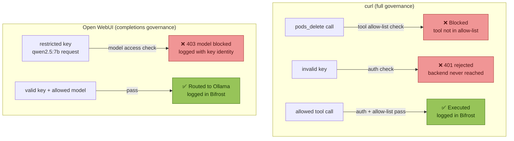
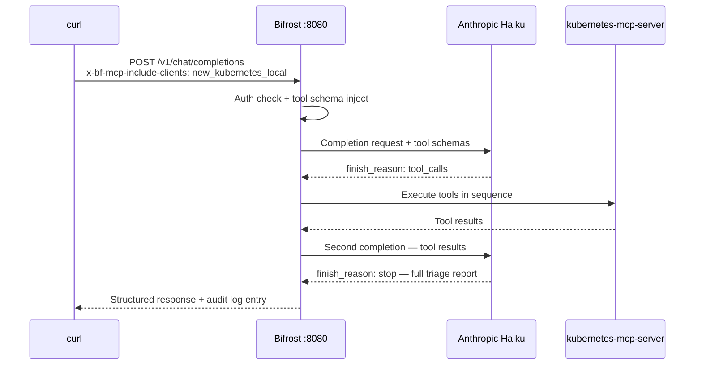

# Bifrost Demo Guide
**Kubernetes MCP + Prometheus MCP + Open WebUI — devops-lab cluster**
`devops-lab` · `bifrost-k8s-demo` · May 2026

---

## Overview

This guide covers 10 demos showing Bifrost as an AI gateway with full MCP tool governance. Each demo can be run via curl, Open WebUI, or the Postman collection.

**What is registered in Bifrost:**

| MCP Server | Tools | Connection | Prefix |
|---|---|---|---|
| `new_kubernetes_local` | 20 | SSE → `http://192.168.1.21:8811/sse` | `new_kubernetes_local-` |
| `prometheus` | 28 | HTTP (Streamable) → `http://prometheus-mcp.monitoring.svc.cluster.local:8080/mcp` | `prometheus-` |

**Virtual Keys:**

| Key | Access |
|---|---|
| Admin key | All 48 tools, all models |
| Restricted key | 7 read-only Kubernetes tools, `llama3.2:3b` only |

---

## Prerequisites

### 1. Port-forwards

All demos assume these port-forwards are running:

```bash
kubectl -n ai-gateway port-forward svc/bifrost 8080:8080 &
kubectl -n monitoring port-forward svc/kube-prometheus-stack-prometheus 9090:9090 &
kubectl -n monitoring port-forward svc/kube-prometheus-stack-grafana 3000:80 &
kubectl -n argocd port-forward svc/argocd-server 9080:80 &
```

Verify:
```bash
lsof -i :8080 | grep kubectl
```

### 2. Ollama

Ollama must be listening on all interfaces (not just localhost) so Bifrost can reach it from inside kind:

```bash
lsof -i :11434 | grep -E "\*|0\.0\.0\.0"
# If not showing — restart: OLLAMA_HOST=0.0.0.0 ollama serve
```

Pre-warm large models before demos (first call takes 30–60s):

```bash
ollama run qwen3-coder:30b "hello" && exit
```

### 3. MCP Servers — confirm both connected

```bash
curl -s -X POST http://localhost:8080/mcp \
  -H "Content-Type: application/json" \
  -H "X-Api-Key: <your-admin-key>" \
  -d '{"jsonrpc":"2.0","id":1,"method":"tools/list","params":{}}' \
  | jq '[.result.tools[].name] | group_by(split("-")[0]) | map({prefix: .[0] | split("-")[0], count: length})'
# Expected: new_kubernetes_local: 20, prometheus: 28
```


### 5. Open WebUI pre-flight (if using for demos)

```bash
# Check container is running
docker ps | grep open-webui

# Verify env vars are correct
docker inspect open-webui | jq '.[0].Config.Env | map(select(startswith("OPENAI")))'
# Expected: OPENAI_API_BASE_URL=http://host.docker.internal:8080/v1

# Quick sanity check
curl -s http://localhost:8080/v1/chat/completions \
  -H "Content-Type: application/json" \
  -H "X-Api-Key: $KEY_ALL" \
  -d '{"model":"openai/llama3.2:3b","messages":[{"role":"user","content":"ping"}],"max_tokens":5}' \
  | jq '.choices[0].message.content'
```

If Open WebUI shows no models in the dropdown:
- Check `OPENAI_API_BASE_URL` points to `http://host.docker.internal:8080/v1` not `http://localhost:11434`
- Restart if needed: `docker restart open-webui`

If Bifrost logs are not showing Open WebUI requests — the requests are going directly to Ollama. The `OPENAI_API_BASE_URL` must point at Bifrost (`:8080`), not Ollama (`:11434`).

### 5. Quick end-to-end check

```bash
export KEY_ALL="<your-admin-key>"
export KEY_RESTRICTED="<your-restricted-key>"
export BIFROST="http://localhost:8080"
export BF="http://localhost:8080/mcp"

curl -s $BIFROST/v1/chat/completions \
  -H "Content-Type: application/json" \
  -H "X-Api-Key: $KEY_ALL" \
  -d '{"model":"openai/llama3.2:3b","messages":[{"role":"user","content":"ping"}],"max_tokens":5}' \
  | jq '.choices[0].message.content'
```

---

## Available Models

| Model string | Size | Best for |
|---|---|---|
| `openai/llama3.2:3b` | 3B | Very fast, simple queries |
| `openai/qwen2.5:7b` | 7B | Fast general queries |
| `openai/qwen2.5-coder:7b` | 7B | Code and k8s tasks |
| `openai/qwen3-coder:30b` | 30B | Best local quality, complex diagnosis |
| `openai/gemma4:latest` | 8B | General purpose |
| `anthropic/claude-haiku-4-5-20251001` | — | Cloud — fast, tool-capable |
| `anthropic/claude-sonnet-4-5-20250929` | — | Cloud — best quality |

> Note: `openai/qwen2.5-coder:1.5b-base` is a base model and does not support chat completions — use `qwen2.5-coder:7b` instead.

---

## Demo 1: Cluster Triage — Full Namespace Overview

**Narrative:** Get a complete picture of cluster health in one pass — pods, events, resource usage — all through Bifrost with full audit trail.

**Pre-req state:** `goose-test` namespace live with mixed-health workloads.

### Via curl

```bash
# Step 1 — list all pods
curl -s -X POST $BF \
  -H "Content-Type: application/json" \
  -H "X-Api-Key: $KEY_ALL" \
  -d '{"jsonrpc":"2.0","id":1,"method":"tools/call","params":{"name":"new_kubernetes_local-pods_list","arguments":{}}}' \
  | jq -r '.result.content[0].text'

# Step 2 — namespace events
curl -s -X POST $BF \
  -H "Content-Type: application/json" \
  -H "X-Api-Key: $KEY_ALL" \
  -d '{"jsonrpc":"2.0","id":2,"method":"tools/call","params":{"name":"new_kubernetes_local-events_list","arguments":{"namespace":"goose-test"}}}' \
  | jq -r '.result.content[0].text'

# Step 3 — node resource usage
curl -s -X POST $BF \
  -H "Content-Type: application/json" \
  -H "X-Api-Key: $KEY_ALL" \
  -d '{"jsonrpc":"2.0","id":3,"method":"tools/call","params":{"name":"new_kubernetes_local-nodes_top","arguments":{}}}' \
  | jq -r '.result.content[0].text'

# Step 4 — pod resource usage
curl -s -X POST $BF \
  -H "Content-Type: application/json" \
  -H "X-Api-Key: $KEY_ALL" \
  -d '{"jsonrpc":"2.0","id":4,"method":"tools/call","params":{"name":"new_kubernetes_local-pods_top","arguments":{"namespace":"goose-test"}}}' \
  | jq -r '.result.content[0].text'
```

### Via Postman

Open the **🔑 Admin (Full Access)** folder → run **List all pods**, **List events in namespace**, **Node resource usage (top)**, **Pod resource usage (top)** in sequence. The Visualize tab renders colour-coded status tables for each.

**What Bifrost does:** Each tool call is logged individually in the Bifrost Logs tab with key identity, tool name, and timestamp — full audit trail of everything read.

---

## Demo 2: Cost Attribution — Namespace Workload Inventory

**Narrative:** Show how Bifrost creates an audit trail linking every cluster query to a virtual key, enabling cost attribution and access tracking across teams.

**Pre-req state:** None — any live namespace works.

### Via curl

```bash
# Namespaces
curl -s -X POST $BF \
  -H "Content-Type: application/json" \
  -H "X-Api-Key: $KEY_ALL" \
  -d '{"jsonrpc":"2.0","id":1,"method":"tools/call","params":{"name":"new_kubernetes_local-namespaces_list","arguments":{}}}' \
  | jq -r '.result.content[0].text'

# Pod resource usage across all namespaces
curl -s -X POST $BF \
  -H "Content-Type: application/json" \
  -H "X-Api-Key: $KEY_ALL" \
  -d '{"jsonrpc":"2.0","id":2,"method":"tools/call","params":{"name":"new_kubernetes_local-pods_top","arguments":{"all_namespaces":true}}}' \
  | jq -r '.result.content[0].text'
```

Both calls appear in Bifrost Logs attributed to the same virtual key — full audit trail.

### Via Open WebUI

1. Open `http://localhost:3001` → New Chat
2. Select `openai/gemma4:latest`
3. Send:
```
How would you attribute Kubernetes resource costs across namespaces?
What metrics would you track for internal chargeback reporting?
```

**What Bifrost does:** Via curl — both tool calls logged with key identity. Via Open WebUI — routes to Ollama via Bifrost completions API, knowledge-based response, completion logged in Bifrost.

---

## Demo 3: CrashLoopBackOff Diagnosis

**Narrative:** A pod is crashing. Walk through diagnosis — pod state, logs, events — all through Bifrost with full audit trail of everything read.

**Pre-req state:** `goose-test` namespace with `bad-app` pods running.

### Via curl

```bash
# Step 1 — list pods to get current generated pod name
curl -s -X POST $BF \
  -H "Content-Type: application/json" \
  -H "X-Api-Key: $KEY_ALL" \
  -d '{"jsonrpc":"2.0","id":1,"method":"tools/call","params":{"name":"new_kubernetes_local-pods_list_in_namespace","arguments":{"namespace":"goose-test"}}}' \
  | jq -r '.result.content[0].text'

# Step 2 — get pod detail (substitute actual pod name from step 1)
curl -s -X POST $BF \
  -H "Content-Type: application/json" \
  -H "X-Api-Key: $KEY_ALL" \
  -d '{"jsonrpc":"2.0","id":2,"method":"tools/call","params":{"name":"new_kubernetes_local-pods_get","arguments":{"name":"<pod-name>","namespace":"goose-test"}}}' \
  | jq -r '.result.content[0].text'

# Step 3 — pod logs
curl -s -X POST $BF \
  -H "Content-Type: application/json" \
  -H "X-Api-Key: $KEY_ALL" \
  -d '{"jsonrpc":"2.0","id":3,"method":"tools/call","params":{"name":"new_kubernetes_local-pods_log","arguments":{"name":"<pod-name>","namespace":"goose-test","tail":50}}}' \
  | jq -r '.result.content[0].text'

# Step 4 — namespace events
curl -s -X POST $BF \
  -H "Content-Type: application/json" \
  -H "X-Api-Key: $KEY_ALL" \
  -d '{"jsonrpc":"2.0","id":4,"method":"tools/call","params":{"name":"new_kubernetes_local-events_list","arguments":{"namespace":"goose-test"}}}' \
  | jq -r '.result.content[0].text'
```

> Pod names include a replicaset hash suffix — always run `pods_list_in_namespace` first to get the current name before calling `pods_get` or `pods_log`.

### Via Postman

Open **🔑 Admin (Full Access)** → run **List pods in namespace**, **Get single pod**, **Get pod logs**, **List events in namespace** in sequence.

**What Bifrost does:** Each tool call (`pods_list_in_namespace`, `pods_get`, `pods_log`, `events_list`) is logged individually with exact arguments — full audit trail.

---

## Demo 4: Argo CD Application Status via CRDs

**Narrative:** Query Argo CD Application resources — no argocd CLI, no direct cluster access. The `resources_list` tool works for any CRD.

**Pre-req state:** Argo CD Applications are live.

### Via curl

```bash
# List all Applications
curl -s -X POST $BF \
  -H "Content-Type: application/json" \
  -H "X-Api-Key: $KEY_ALL" \
  -d '{"jsonrpc":"2.0","id":1,"method":"tools/call","params":{"name":"new_kubernetes_local-resources_list","arguments":{"apiVersion":"argoproj.io/v1alpha1","kind":"Application","namespace":"argocd"}}}' \
  | jq -r '.result.content[0].text'

# Get a specific Application
curl -s -X POST $BF \
  -H "Content-Type: application/json" \
  -H "X-Api-Key: $KEY_ALL" \
  -d '{"jsonrpc":"2.0","id":2,"method":"tools/call","params":{"name":"new_kubernetes_local-resources_get","arguments":{"apiVersion":"argoproj.io/v1alpha1","kind":"Application","name":"podinfo","namespace":"argocd"}}}' \
  | jq -r '.result.content[0].text'
```

### Via Postman

Open **🔑 Admin (Full Access) → Resources** → run **List resources — ArgoCD Applications** and **Get single resource — ArgoCD Application**. The visualizer shows health and sync status colour coded.

**Validated output (May 2026):**

| Application | Sync | Health | Namespace |
|---|---|---|---|
| `guestbook` | ✅ Synced | ✅ Healthy | `apps` |
| `kyverno-policies` | ✅ Synced | ✅ Healthy | `kyverno` |
| `load-generator` | ✅ Synced | ✅ Healthy | `apps` |
| `podinfo` | ✅ Synced | ✅ Healthy | `apps` |
| `prometheus-rules` | ✅ Synced | ✅ Healthy | `monitoring` |

**What Bifrost does:** `resources_list` for the `Application` CRD is governed and logged — same pattern works for any CRD in the cluster.

---

## Demo 5: Governance Boundary — Destructive Tools Blocked

**Narrative:** A developer attempts destructive operations. Bifrost enforces the tool allow-list and blocks attempts at the gateway before they reach the MCP server.

**Pre-req state:** Restricted key configured with 7 read-only tools only — no `pods_delete`, `resources_scale`, or `pods_exec`.



### Via curl

```bash
# Attempt 1 — delete a pod (blocked)
curl -s -X POST $BF \
  -H "Content-Type: application/json" \
  -H "X-Api-Key: $KEY_RESTRICTED" \
  -d '{"jsonrpc":"2.0","id":1,"method":"tools/call","params":{"name":"new_kubernetes_local-pods_delete","arguments":{"name":"bifrost-0","namespace":"ai-gateway"}}}' \
  | jq '{attempt: "pods_delete", result: .error.message}'

# Attempt 2 — scale StatefulSet to zero (blocked)
curl -s -X POST $BF \
  -H "Content-Type: application/json" \
  -H "X-Api-Key: $KEY_RESTRICTED" \
  -d '{"jsonrpc":"2.0","id":2,"method":"tools/call","params":{"name":"new_kubernetes_local-resources_scale","arguments":{"apiVersion":"apps/v1","kind":"StatefulSet","name":"bifrost","namespace":"ai-gateway","scale":0}}}' \
  | jq '{attempt: "resources_scale", result: .error.message}'

# Attempt 3 — exec into a pod (blocked)
curl -s -X POST $BF \
  -H "Content-Type: application/json" \
  -H "X-Api-Key: $KEY_RESTRICTED" \
  -d '{"jsonrpc":"2.0","id":3,"method":"tools/call","params":{"name":"new_kubernetes_local-pods_exec","arguments":{"name":"bifrost-0","namespace":"ai-gateway","command":["cat","/etc/passwd"]}}}' \
  | jq '{attempt: "pods_exec", result: .error.message}'
```

All three return tool-not-found. Check Bifrost Logs — all three blocked attempts are recorded with key identity, timestamp, and tool name.

### Via Postman

Open **🚫 Restricted — Access Denied Examples** → run all three requests. Each renders a red "Access Denied — As Expected" banner in the Visualize tab showing the tool attempted, key used, and actual error response.

### Via Open WebUI

1. Configure Open WebUI with the restricted virtual key
2. Select `openai/qwen2.5:7b` (blocked model)
3. Send any message — Open WebUI receives a 403 error
4. Check Bifrost Logs — the blocked request is recorded with key identity

**What Bifrost does:** Tool allow-list enforced at the gateway — destructive tool calls never reach the MCP server. Every blocked attempt is logged. Model-level access control enforced at the completions layer.

---

## Demo 6: LLM-Driven Multi-Step Diagnosis (Agent Mode)

**Narrative:** The LLM investigates a mixed-health namespace autonomously — calling multiple tools in sequence and synthesising a full structured diagnosis.

**Pre-req state:** `goose-test` namespace live. `tools_to_auto_execute: ["*"]` set on the MCP client in Bifrost UI.



### Via curl

```bash
curl -s -X POST $BIFROST/v1/chat/completions \
  -H "Content-Type: application/json" \
  -H "X-Api-Key: $KEY_ALL" \
  -H "x-bf-mcp-include-clients: new_kubernetes_local" \
  -d '{"model":"anthropic/claude-haiku-4-5-20251001","messages":[{"role":"user","content":"Investigate the goose-test namespace. List pods, check resource consumption, look for warning events. Tell me which apps are healthy, which are not, and why."}]}' \
  | jq -r '.choices[0].message.content'
```

### Via Open WebUI

1. Open `http://localhost:3001` → New Chat
2. Select `openai/qwen3-coder:30b`
3. Send:
```
What does a thorough Kubernetes namespace health assessment cover?
List the checks, what to look for, and how to rate each finding by severity.
```

**Validated output (May 2026):**

| Workload | Status | Diagnosis |
|---|---|---|
| `good-app` | ✅ Healthy | 3 replicas, pinned digest, probes, non-root |
| `bad-app` | ⚠️ Violations | `nginx:latest`, no probes, Kyverno violations |
| `ugly-app` | ⚠️ Violations | `:latest` tag, no probes, policy violations |
| `single-app` | ⚠️ Security | Runs as root, `allowPrivilegeEscalation: true` |
| `scheduled-job` | ✅ Healthy | CronJob completing successfully |
| `completed-job` | ✅ Healthy | Completed job |

**What Bifrost does:** Full agentic loop runs inside Bifrost — three separate log entries per tool call plus the final completion entry. The caller makes one request and receives one response.

---

## Demo 7: Local vs Cloud Model Comparison

**Narrative:** Same query routed to local Ollama and Anthropic Claude through the same endpoint. Shows the quality/cost/latency tradeoff with identical governance applied to both.

**Pre-req state:** `qwen3-coder:30b` pre-warmed.

### Via curl

```bash
echo "=== LOCAL: openai/qwen2.5:7b (fast, zero cost) ==="
time curl -s -X POST $BIFROST/v1/chat/completions \
  -H "Content-Type: application/json" \
  -H "X-Api-Key: $KEY_ALL" \
  -H "x-bf-mcp-include-clients: new_kubernetes_local" \
  -d '{"model":"openai/qwen2.5:7b","messages":[{"role":"user","content":"Investigate the goose-test namespace and tell me which apps are unhealthy."}]}' \
  | jq -r '.choices[0].message.content'

echo "=== LOCAL: openai/qwen3-coder:30b (best local quality, zero cost) ==="
time curl -s -X POST $BIFROST/v1/chat/completions \
  -H "Content-Type: application/json" \
  -H "X-Api-Key: $KEY_ALL" \
  -H "x-bf-mcp-include-clients: new_kubernetes_local" \
  -d '{"model":"openai/qwen3-coder:30b","messages":[{"role":"user","content":"Investigate the goose-test namespace and tell me which apps are unhealthy."}]}' \
  | jq -r '.choices[0].message.content'

echo "=== CLOUD: anthropic/claude-sonnet-4-5 ==="
time curl -s -X POST $BIFROST/v1/chat/completions \
  -H "Content-Type: application/json" \
  -H "X-Api-Key: $KEY_ALL" \
  -H "x-bf-mcp-include-clients: new_kubernetes_local" \
  -d '{"model":"anthropic/claude-sonnet-4-5-20250929","messages":[{"role":"user","content":"Investigate the goose-test namespace and tell me which apps are unhealthy."}]}' \
  | jq -r '.choices[0].message.content'
```

### Via Open WebUI

1. Open `http://localhost:3001` → New Chat → click **+** to add a second model
2. Select `openai/qwen2.5:7b` and `openai/qwen3-coder:30b`
3. Send any message — both respond side by side
4. Check Bifrost Logs — two entries appear simultaneously, one per model

**Validated results (May 2026):**

| Model | Latency | Quality |
|---|---|---|
| `qwen2.5:7b` | ~2s | Basic identification |
| `qwen3-coder:30b` | ~18s | Good detail, misses policy nuance |
| `claude-sonnet-4-5-20250929` | ~4.5s | Full diagnosis: Kyverno violations, missing probes, security context, root cause per app |

**What Bifrost does:** Same endpoint, same virtual key, model routing is Bifrost's responsibility. Both local and cloud requests appear in Bifrost Logs with provider, model, latency, and token counts.

---

## Demo 8: Fast Local Query (Sub-2s Inference)

**Narrative:** Not every query needs a cloud model. Show sub-2-second namespace categorisation using the local 3B model — zero API cost, full audit trail.

### Via curl

```bash
curl -s -X POST $BIFROST/v1/chat/completions \
  -H "Content-Type: application/json" \
  -H "X-Api-Key: $KEY_ALL" \
  -H "x-bf-mcp-include-clients: new_kubernetes_local" \
  -d '{"model":"openai/llama3.2:3b","messages":[{"role":"user","content":"List all namespaces in the cluster and categorise them as system, infrastructure, or application namespaces."}]}' \
  | jq -r '.choices[0].message.content'
```

### Via Open WebUI

1. Open `http://localhost:3001` → New Chat
2. Select `openai/gemma4:latest`
3. Send:
```
List all Kubernetes namespaces and categorise each one as system,
infrastructure, or application. Give a brief reason for each.
```

**What Bifrost does:** Routes to local Ollama via the `openai` provider. Bifrost Logs shows provider `openai`, latency ~1.5–2s, zero upstream API cost.

---

## Demo 9: Code Mode — Token and Latency Reduction

**Narrative:** The agentic loop in Demo 6 injects tool schemas into every request, consuming a large portion of token budgets. Code Mode reduces this — the LLM writes Python to orchestrate tools in a single pass instead of issuing individual tool calls. Validated result on this cluster: **46% latency reduction, 44% fewer completion tokens**.

**Pre-req state:** `tools_to_auto_execute: ["*"]` set. Anthropic Haiku provider registered.

> Code Mode is enabled per MCP client: Bifrost UI → **MCP** → `new_kubernetes_local` → **Edit** → toggle **Code Mode Client** on. Toggle back off after the demo.

### Via curl

**Step 1 — Agent Mode baseline (Code Mode OFF):**

```bash
time curl -s -X POST $BIFROST/v1/chat/completions \
  -H "Content-Type: application/json" \
  -H "X-Api-Key: $KEY_ALL" \
  -H "x-bf-mcp-include-clients: new_kubernetes_local" \
  -d '{"model":"anthropic/claude-haiku-4-5-20251001","messages":[{"role":"user","content":"Triage the cluster. Check for warning events, pods not in Running state, and node resource pressure. Give me a structured summary with severity ratings."}]}' \
  | jq '{mode: "agent", prompt_tokens: .usage.prompt_tokens, completion_tokens: .usage.completion_tokens, total_tokens: .usage.total_tokens, latency_ms: .extra_fields.latency}'
```

**Step 2 — toggle Code Mode Client ON in Bifrost UI → Save, then run the same query:**

```bash
time curl -s -X POST $BIFROST/v1/chat/completions \
  -H "Content-Type: application/json" \
  -H "X-Api-Key: $KEY_ALL" \
  -H "x-bf-mcp-include-clients: new_kubernetes_local" \
  -d '{"model":"anthropic/claude-haiku-4-5-20251001","messages":[{"role":"user","content":"Triage the cluster. Check for warning events, pods not in Running state, and node resource pressure. Give me a structured summary with severity ratings."}]}' \
  | jq '{mode: "code", prompt_tokens: .usage.prompt_tokens, completion_tokens: .usage.completion_tokens, total_tokens: .usage.total_tokens, latency_ms: .extra_fields.latency}'
```

**Validated Output (May 2026):**

| Metric | Agent Mode | Code Mode | Difference |
|---|---|---|---|
| Prompt tokens | 26,748 | 25,678 | -1,070 (-4%) |
| Completion tokens | 2,260 | 1,262 | -998 (-44%) |
| Total tokens | 29,008 | 26,940 | -2,068 (-7%) |
| Latency | 19,956ms | 10,860ms | -9,096ms (-46%) |

**Talking point:** _"Same query, same endpoint, same governance. Code Mode nearly halved the latency — 20 seconds down to 11 — and cut completion tokens by 44%. Toggle one setting in the UI, no code change required."_

---

## Demo 10: Automatic Provider Failover

**Narrative:** A primary provider goes down. Bifrost automatically routes to a fallback — zero application changes, zero downtime.

**Pre-req state:** Ollama running, `openai` provider registered as fallback to Anthropic.

### Via curl

**Step 1 — confirm primary (Anthropic) is working:**

```bash
curl -s -X POST $BIFROST/v1/chat/completions \
  -H "Content-Type: application/json" \
  -H "X-Api-Key: $KEY_ALL" \
  -d '{"model":"anthropic/claude-haiku-4-5-20251001","messages":[{"role":"user","content":"ping"}],"max_tokens":20}' \
  | jq '{provider: .extra_fields.provider, response: .choices[0].message.content}'
```

Expected: `provider: "anthropic"`

**Step 2 — simulate primary failure:**

In the Bifrost UI → **Providers → Anthropic → Edit key** → change the API key to `invalid-key-failover-demo` → **Save**.

**Step 3 — send the same request — Bifrost routes to Ollama fallback:**

```bash
curl -s -X POST $BIFROST/v1/chat/completions \
  -H "Content-Type: application/json" \
  -H "X-Api-Key: $KEY_ALL" \
  -d '{"model":"anthropic/claude-haiku-4-5-20251001","messages":[{"role":"user","content":"ping"}],"max_tokens":20}' \
  | jq '{provider: .extra_fields.provider, response: .choices[0].message.content}'
```

Expected: `provider: "openai"` — Bifrost routed to Ollama fallback transparently.

**Step 4 — restore the Anthropic key in the Bifrost UI.**

### Via Open WebUI

1. Configure with the admin virtual key
2. Send any message while the Anthropic key is invalid
3. Response arrives via Ollama fallback — user sees no error
4. Check Bifrost Logs — failed Anthropic attempt and successful fallback both logged

**Talking point:** _"The application sent the same request. Bifrost detected the failure and transparently rerouted to local Ollama. The user saw no error. Logs show exactly what happened — primary failed, fallback succeeded. No code change, no restart."_

---

## Demo 11: Prometheus MCP — Live Cluster Metrics via MCP

**Narrative:** Query Prometheus directly through the MCP interface — no PromQL knowledge required, no browser needed. The same Bifrost endpoint that handles Kubernetes tool calls also handles Prometheus queries.

**Pre-req state:** Prometheus MCP server connected (28 tools registered). Bifrost metrics being scraped via ServiceMonitor.

### Via curl

```bash
# Prometheus health check
curl -s -X POST $BF \
  -H "Content-Type: application/json" \
  -H "X-Api-Key: $KEY_ALL" \
  -d '{"jsonrpc":"2.0","id":1,"method":"tools/call","params":{"name":"prometheus-healthy","arguments":{}}}' \
  | jq -r '.result.content[0].text'

# All scrape targets — confirm bifrost is being scraped
curl -s -X POST $BF \
  -H "Content-Type: application/json" \
  -H "X-Api-Key: $KEY_ALL" \
  -d '{"jsonrpc":"2.0","id":2,"method":"tools/call","params":{"name":"prometheus-list_targets","arguments":{}}}' \
  | jq -r '.result.content[0].text'

# CPU usage by pod — sorted highest first
curl -s -X POST $BF \
  -H "Content-Type: application/json" \
  -H "X-Api-Key: $KEY_ALL" \
  -d '{"jsonrpc":"2.0","id":3,"method":"tools/call","params":{"name":"prometheus-query","arguments":{"query":"sum(rate(container_cpu_usage_seconds_total{container!=\"\"}[5m])) by (namespace, pod)"}}}' \
  | jq -r '.result.content[0].text'

# Memory usage by pod
curl -s -X POST $BF \
  -H "Content-Type: application/json" \
  -H "X-Api-Key: $KEY_ALL" \
  -d '{"jsonrpc":"2.0","id":4,"method":"tools/call","params":{"name":"prometheus-query","arguments":{"query":"sum(container_memory_working_set_bytes{container!=\"\"}}) by (namespace, pod)"}}}' \
  | jq -r '.result.content[0].text'

# Bifrost gateway metrics — requests by model
curl -s -X POST $BF \
  -H "Content-Type: application/json" \
  -H "X-Api-Key: $KEY_ALL" \
  -d '{"jsonrpc":"2.0","id":5,"method":"tools/call","params":{"name":"prometheus-query","arguments":{"query":"sum(bifrost_upstream_requests_total) by (provider, model, key_name)"}}}' \
  | jq -r '.result.content[0].text'

# Active alerts
curl -s -X POST $BF \
  -H "Content-Type: application/json" \
  -H "X-Api-Key: $KEY_ALL" \
  -d '{"jsonrpc":"2.0","id":6,"method":"tools/call","params":{"name":"prometheus-list_alerts","arguments":{}}}' \
  | jq -r '.result.content[0].text'
```

### Via Postman

Open the **🔥 Prometheus — Metrics & Queries** folder. Run requests in order:

1. **Health check** — confirms Prometheus is reachable via MCP
2. **List scrape targets** — shows all jobs including `bifrost` and `bifrost-headless`
3. **Instant query — up** — 24 UP / 0 DOWN stat card with full target table
4. **CPU usage by pod** — sorted table, highest consumer first
5. **Memory usage by pod** — human-readable MB/GB values
6. **Active alerts** — live firing alerts or ✓ No active alerts

Then open **🔮 Bifrost — Gateway Metrics**:

1. **Total requests** — stat card with provider/model/key breakdown
2. **Upstream latency p99** — colour coded green/amber/red by threshold
3. **Token rate (5m)** — tokens/second per model

> To populate Bifrost metrics, run `bash scripts/bifrost-sim.sh` first and wait 30 seconds for Prometheus to scrape.

**What Bifrost does:** The same virtual key that governs Kubernetes tool calls also governs Prometheus queries. Both are logged in Bifrost Logs with identical audit trail. Cluster metrics and LLM usage metrics are queryable from the same MCP interface.

---

## Additional Bifrost Features

### Semantic Caching

```bash
# First call — hits the provider
time curl -s -X POST $BIFROST/v1/chat/completions \
  -H "Content-Type: application/json" \
  -H "X-Api-Key: $KEY_ALL" \
  -d '{"model":"openai/qwen2.5:7b","messages":[{"role":"user","content":"What is a Kubernetes ConfigMap?"}],"max_tokens":100}' \
  | jq '{latency: .extra_fields.latency, cached: .extra_fields.cached}'

# Second call — semantically similar, should hit cache
time curl -s -X POST $BIFROST/v1/chat/completions \
  -H "Content-Type: application/json" \
  -H "X-Api-Key: $KEY_ALL" \
  -d '{"model":"openai/qwen2.5:7b","messages":[{"role":"user","content":"Explain what ConfigMaps are in Kubernetes."}],"max_tokens":100}' \
  | jq '{latency: .extra_fields.latency, cached: .extra_fields.cached}'
```

> Requires a vector store (Weaviate, Qdrant, Redis, or Pinecone) configured in Bifrost UI → **Settings → Caching**.

### Budget Enforcement per Virtual Key

Set a maximum spend (USD) on a virtual key. Bifrost enforces the limit — requests beyond the budget return a 429 before reaching any provider.

Bifrost UI → **Keys → Edit** → **Provider Budget → Maximum Spend (USD)**.

**Talking point:** _"Cost control at the gateway layer — not on the provider invoice. Per-team or per-application budgets enforced before the request leaves the building."_

### Drop-in SDK Replacement

```python
# Before — direct to Anthropic
from anthropic import Anthropic
client = Anthropic()

# After — through Bifrost (one line change)
from anthropic import Anthropic
client = Anthropic(base_url="http://localhost:8080/anthropic")
```

```python
# OpenAI SDK
from openai import OpenAI
client = OpenAI(
    base_url="http://localhost:8080/openai",
    api_key=BIFROST_VIRTUAL_KEY
)
```

### Weighted Load Balancing

Register multiple API keys for the same provider with different weights. Bifrost distributes traffic according to weights — useful for staying under rate limits.

Bifrost UI → **Providers → Anthropic → Add Key** → set `weight: 0.7` primary, `weight: 0.3` secondary.

---

## Observability

### Bifrost Dashboard

The Bifrost UI at `http://localhost:8080` provides a real-time dashboard covering request volume, token usage, model rankings, cost, latency percentiles, and cache hit rate.


The **Logs** tab shows every request across all surfaces:


| Metric | What it shows |
|---|---|
| **Total Requests** | Every call across all surfaces |
| **Success Rate** | Overall success rate including blocked requests |
| **Avg Latency** | Driven up by agentic MCP tool loop calls |
| **Total Tokens** | Full accounting including tool schema injection |
| **Total Cost** | All cloud provider costs for the session |
| **Provider column** | `ANTHROPIC` for Haiku/Sonnet, `OPENAI` for Ollama |

### Prometheus + Grafana

Bifrost metrics are scraped by Prometheus every 15 seconds via a ServiceMonitor. Access Grafana at `http://localhost:3000` and Prometheus at `http://localhost:9090`.

```bash
# Verify Bifrost is being scraped
curl -s http://localhost:9090/api/v1/targets | python3 -c "
import json,sys
d=json.load(sys.stdin)
targets=[t for t in d['data']['activeTargets'] if 'bifrost' in str(t.get('labels',{}))]
for t in targets:
    print('job:', t['labels'].get('job'), '| health:', t['health'])
"
```

See [docs/Prometheus MCP Server — Deployment & Demo Guide.md](Prometheus%20MCP%20Server%20—%20Deployment%20%26%20Demo%20Guide.md) for the full Prometheus integration setup.

---

## Suggested Demo Order

| Order | Demo | Duration | Key message |
|---|---|---|---|
| 1 | **Demo 5** — Governance block | 2 min | Opens with security |
| 2 | **Demo 8** — Fast local query | 2 min | Sub-2s local inference, zero cost |
| 3 | **Demo 2** — Cost attribution | 3 min | Audit trail from any surface |
| 4 | **Demo 4** — Argo CD CRDs | 3 min | Works for any CRD |
| 5 | **Demo 3** — CrashLoopBackOff | 4 min | Real operational workflow |
| 6 | **Demo 11** — Prometheus MCP | 4 min | Cluster + LLM metrics, one interface |
| 7 | **Demo 6** — Multi-step diagnosis | 5 min | Agentic loop under governance |
| 8 | **Demo 9** — Code Mode | 3 min | 46% latency reduction |
| 9 | **Demo 10** — Failover | 3 min | Zero-downtime provider switching |
| 10 | **Demo 7** — Local vs Cloud | 5 min | Model tradeoffs, same endpoint |
| 11 | **Demo 1** — Cluster triage | 4 min | Closes with the full picture |

---

## Quick Reference — Tool Names

### Kubernetes (`new_kubernetes_local-`)

```
new_kubernetes_local-configuration_contexts_list
new_kubernetes_local-configuration_view
new_kubernetes_local-events_list
new_kubernetes_local-namespaces_list
new_kubernetes_local-nodes_log
new_kubernetes_local-nodes_stats_summary
new_kubernetes_local-nodes_top
new_kubernetes_local-pods_delete
new_kubernetes_local-pods_exec
new_kubernetes_local-pods_get
new_kubernetes_local-pods_list
new_kubernetes_local-pods_list_in_namespace
new_kubernetes_local-pods_log
new_kubernetes_local-pods_run
new_kubernetes_local-pods_top
new_kubernetes_local-resources_create_or_update
new_kubernetes_local-resources_delete
new_kubernetes_local-resources_get
new_kubernetes_local-resources_list
new_kubernetes_local-resources_scale
```

### Prometheus (`prometheus-`)

```
prometheus-alertmanagers       prometheus-build_info
prometheus-clean_tombstones    prometheus-config
prometheus-delete_series       prometheus-docs_list
prometheus-docs_read           prometheus-docs_search
prometheus-exemplar_query      prometheus-flags
prometheus-healthy             prometheus-label_names
prometheus-label_values        prometheus-list_alerts
prometheus-list_rules          prometheus-list_targets
prometheus-metric_metadata     prometheus-query
prometheus-quit                prometheus-range_query
prometheus-ready               prometheus-reload
prometheus-runtime_info        prometheus-series
prometheus-snapshot            prometheus-targets_metadata
prometheus-tsdb_stats          prometheus-wal_replay_status
```

> Run `tools/list` via the MCP endpoint to confirm the full current list.

---

## Troubleshooting

### Ollama

| Issue | Root cause | Fix |
|---|---|---|
| Empty response from connectivity test | Ollama bound to `localhost` only | `OLLAMA_HOST=0.0.0.0 ollama serve` |
| `404 page not found` | Wrong provider type — native `ollama` hits `/api/chat` | Register as `openai` provider type |
| `404 page not found` with `openai` type | Double `/v1` path in base URL | Remove `/v1` from base URL — use `http://<IP>:11434` only |
| `model_blocked 403` | Virtual key `allowed_models` missing Ollama model names | Add `openai/*` to allowed_models |
| First call slow (30–60s) | Ollama loading model into memory | Pre-warm: `ollama run qwen3-coder:30b "hello"` |
| `qwen2.5-coder:1.5b-base` returns 400 | Base model — no chat completions support | Use `qwen2.5-coder:7b` instead |

### Kubernetes MCP

| Issue | Root cause | Fix |
|---|---|---|
| Tool not found | Old `kubernetes_local-` prefix used | Use `new_kubernetes_local-` prefix throughout |
| SSE disconnected in Bifrost UI | kubernetes MCP server LaunchAgent restarted on port 8811 | Check `launchctl list \| grep mcp` and verify `http://192.168.1.21:8811/sse` is reachable |
| `x-bf-mcp-include-clients` not working | Wrong client name | Use `new_kubernetes_local` (the Bifrost server name, not the tool prefix) |

### Prometheus MCP

| Issue | Root cause | Fix |
|---|---|---|
| `prometheus-*` tools return 0 in tools/list | Server disconnected or virtual key missing access | Reconnect in Bifrost UI → MCP Catalog; grant access in Virtual Keys |
| `tool execution failed: transport error` | Pod in CrashLoopBackOff | Check `kubectl get pods -n monitoring \| grep prometheus-mcp`; see Prometheus MCP guide |
| `method invalid during initialization` | Using SSE transport — session handshake required | Use HTTP (Streamable) connection type in Bifrost |

### Anthropic

| Issue | Root cause | Fix |
|---|---|---|
| `429 rate_limit_error` | Tool schemas consume large token budget | Use `claude-haiku-4-5-20251001` — higher TPM headroom |
| No tool call follow-through | `tools_to_auto_execute` is null | Set **Tools to Auto Execute: `*`** in Bifrost UI → MCP |
| `model_blocked 403` | Virtual key not linked to Anthropic provider key | Bifrost UI → Keys → Edit → Provider Configurations |

---

## Quick Reference — Endpoints

| Item | Value |
|---|---|
| Bifrost completions | `http://localhost:8080/v1/chat/completions` |
| Bifrost models | `http://localhost:8080/v1/models` |
| Bifrost MCP endpoint | `http://localhost:8080/mcp` |
| Bifrost UI / Logs | `http://localhost:8080` |
| Prometheus | `http://localhost:9090` |
| Grafana | `http://localhost:3000` |
| ArgoCD | `http://localhost:9080` |
| Open WebUI | `http://localhost:3001` |
| Auth header | `X-Api-Key: <virtual-key>` |
| Ollama model prefix | `openai/<modelname>` |
| Anthropic model prefix | `anthropic/<modelname>` |
| Start port-forward | `kubectl -n ai-gateway port-forward svc/bifrost 8080:8080 &` |

---

*Compiled May 2026 from live cluster state — devops-lab (kind).*
