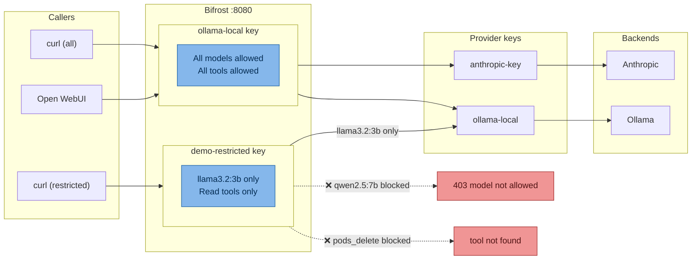
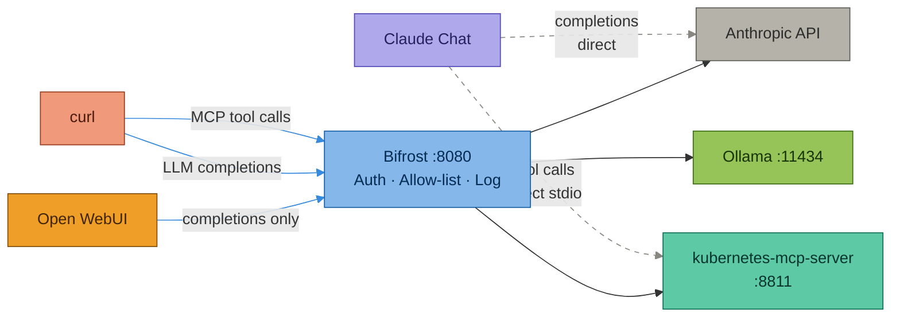
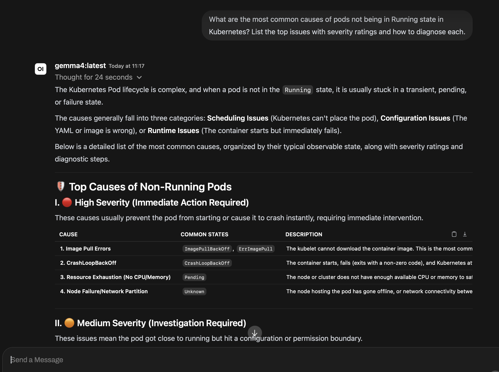
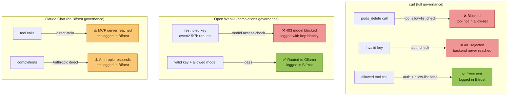
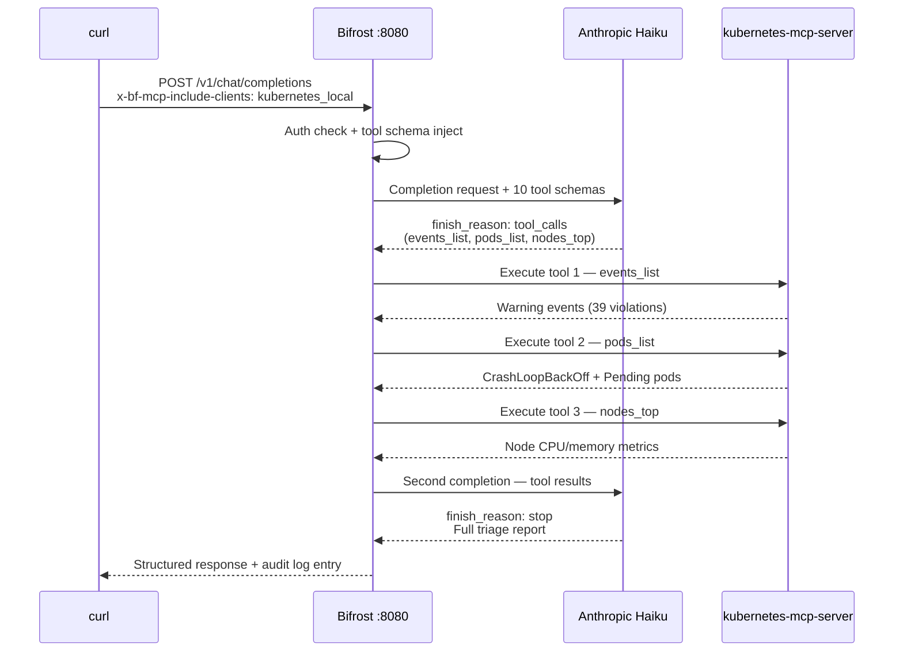
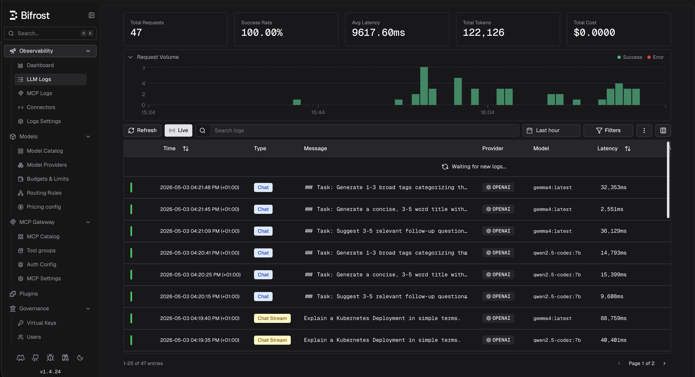

# Bifrost MCP Gateway — Demo Guide

> **Clusters:** k3d-demo / kind-devops-lab (auto-detected)
> **Date:** May 2026
> **Bifrost version:** v1.4.24 prerelease (image: docker.io/maximhq/bifrost:v1.4.24)

---

## Table of Contents

- [Pre-Requisites](#pre-requisites)
  - [1 — Infrastructure running](#1--infrastructure-running)
  - [2 — Bifrost configured](#2--bifrost-configured)
  - [3 — Demo namespace and workloads](#3--demo-namespace-and-workloads)
  - [4 — Confirm CRDs available for Demo 4](#4--confirm-crds-available-for-demo-4)
  - [5 — Ollama running](#5--ollama-running)
  - [6 — Cleanup](#6--cleanup)
- [Key API Facts](#key-api-facts-applies-to-all-demos)
- [How Bifrost Governs All Three Input Channels](#how-bifrost-governs-all-three-input-channels)
- [Demo 1: Cluster Health Triage](#demo-1-cluster-health-triage)
- [Demo 2: Namespace Cost Attribution](#demo-2-namespace-cost-attribution)
- [Demo 3: CrashLoopBackOff Diagnosis](#demo-3-crashloopbackoff-diagnosis)
- [Demo 4: Argo CD Application Status via CRDs](#demo-4-argo-cd-application-status-via-crds)
- [Demo 5: Governance Boundary — Destructive Tools Blocked](#demo-5-governance-boundary--destructive-tools-blocked)
- [Demo 6: LLM-Driven Multi-Step Diagnosis (Agent Mode)](#demo-6-llm-driven-multi-step-diagnosis-agent-mode)
- [Demo 7: Local vs Cloud Model Comparison](#demo-7-local-vs-cloud-model-comparison)
- [Demo 8: Fast Local Query (Sub-2s Inference)](#demo-8-fast-local-query-sub-2s-inference)
- [Demo 9: Code Mode — 50% Token Reduction](#demo-9-code-mode--50-token-reduction)
- [Demo 10: Automatic Provider Failover](#demo-10-automatic-provider-failover)
- [Additional Bifrost Features](#additional-bifrost-features)
  - [Semantic Caching](#semantic-caching)
  - [Budget Enforcement per Virtual Key](#budget-enforcement-per-virtual-key)
  - [Prometheus Metrics + Grafana](#prometheus-metrics--grafana)
  - [Drop-in SDK Replacement](#drop-in-sdk-replacement)
  - [Weighted Load Balancing](#weighted-load-balancing)
- [Bifrost Dashboard — Audit Trail](#bifrost-dashboard--audit-trail)
- [Suggested Demo Order](#suggested-demo-order)
- [Quick Reference — Tool Names](#quick-reference--tool-names)
- [Ollama Models Reference](#ollama-models-reference)
- [Ollama Gotchas](#ollama-gotchas)
- [Anthropic Gotchas](#anthropic-gotchas)

---

## Pre-Requisites

### 1 — Infrastructure running

| Component | Check | Expected |
|---|---|---|
| Bifrost StatefulSet | `kubectl -n ai-gateway get pods` | `bifrost-0` Running |
| Port-forward | `curl -s http://localhost:8080/health` | `{"status":"ok"}` |
| MCP SSE server | `curl -s --max-time 2 http://localhost:8811/sse` | `event: endpoint` |
| MCP Service | `kubectl -n ai-gateway get svc mcp-kubernetes-sse` | ClusterIP present |
| MCP Endpoints (k3d) | `kubectl -n ai-gateway get endpoints mcp-kubernetes-sse` | `192.168.1.21:8811` |
| MCP Endpoints (kind) | `kubectl -n ai-gateway get endpoints mcp-kubernetes-sse` | `192.168.65.254:8811` via socat proxy |

Start anything missing:

```bash
# Port-forward (if not running)
kubectl -n ai-gateway port-forward svc/bifrost 8080:8080 &

# SSE server (if not running)
ENABLE_UNSAFE_SSE_TRANSPORT=1 PORT=8811 HOST=0.0.0.0 \
  npx -y kubernetes-mcp-server@latest &
```

### 2 — Bifrost configured

**Provider — Anthropic (required for MCP tool-injected demos):**

Demos 1, 6, 8, 9, and 10 use `anthropic/claude-haiku-4-5-20251001` with MCP tool injection.
Demo 7 uses both Haiku and `anthropic/claude-sonnet-4-5-20250929` for the local vs cloud comparison.
Demo 10 also requires Ollama as a fallback provider.
This requires the Anthropic provider to be registered in Bifrost before running those demos.

In the Bifrost UI at `http://localhost:8080`:

1. **Providers → Add Provider**

| Field | Value |
|---|---|
| Provider Type | `anthropic` |
| Provider Name | `anthropic` |
| API Key | Your Anthropic API key |
| Models | `claude-sonnet-4-5-20250929`, `claude-haiku-4-5-20251001` |

2. **Keys → Edit your virtual key → Provider Configurations**
   - Add `Anthropic` alongside the existing `OpenAI` entry
   - Under **Allowed Keys** select the `anthropic` provider key
   - Leave **Allowed Models** empty to allow all

3. **Verify the provider is registered:**

```bash
curl -s http://localhost:8080/api/providers \
  -H "X-Api-Key: $BIFROST_VIRTUAL_KEY" \
  | jq '[.providers[].name]'
# Expected: ["openai", "anthropic"]
```

4. **Test the Anthropic route:**

```bash
curl -s http://localhost:8080/v1/chat/completions \
  -H "Content-Type: application/json" \
  -H "X-Api-Key: $BIFROST_VIRTUAL_KEY" \
  -d '{
    "model": "anthropic/claude-haiku-4-5-20251001",
    "messages": [{"role":"user","content":"ping"}],
    "max_tokens": 10
  }' | jq '.choices[0].message.content'
# Expected: "pong" or similar one-word response
```

**Provider — Ollama (required for Demos 7, 8, and Open WebUI):**

Full Ollama setup is covered in [docs/ollama-bifrost-setup.md](ollama-bifrost-setup.md).
Verify the `openai` provider is registered and Ollama is reachable:

```bash
curl -s http://localhost:8080/api/providers \
  -H "X-Api-Key: $BIFROST_VIRTUAL_KEY" \
  | jq '[.providers[].name]'
# Expected: ["openai", "anthropic"]

curl -s http://localhost:8080/v1/chat/completions \
  -H "Content-Type: application/json" \
  -H "X-Api-Key: $BIFROST_VIRTUAL_KEY" \
  -d '{
    "model": "openai/qwen2.5:7b",
    "messages": [{"role":"user","content":"ping"}],
    "max_tokens": 10
  }' | jq '.choices[0].message.content'
```

**MCP server:** `kubernetes_local` registered and connected.

```bash
curl -s http://localhost:8080/api/mcp/clients \
  | jq '{name: .clients[0].config.name, state: .clients[0].state, tools: (.clients[0].tools | length)}'
# Expected: name=kubernetes_local, state=connected, tools=19
```

**Virtual key:** Set and exported.

```bash
echo $BIFROST_VIRTUAL_KEY
# Must not be empty — get from Bifrost UI → Keys
export BIFROST_VIRTUAL_KEY="vk_your_key_here"
```

**Agent mode and tool scoping (one-time UI setup):**

The diagram below shows how virtual keys, provider keys, and tool scoping work together in Bifrost. A restricted key only reaches the backends and models it was scoped to — everything else is blocked at the gateway.




Two settings must be configured on the `kubernetes_local` MCP client in the
Bifrost UI before running Demos 1 and 7.

In the Bifrost UI at `http://localhost:8080` → **MCP** → `kubernetes_local` → **Edit**:

**1. Tools to Execute** — restrict to read-only diagnostic tools only. This reduces
the token schema sent to Anthropic (avoids 429 rate limit errors) and enforces
the governance boundary at the same time:

```
kubernetes_local-events_list
kubernetes_local-pods_list
kubernetes_local-pods_list_in_namespace
kubernetes_local-pods_get
kubernetes_local-pods_log
kubernetes_local-pods_top
kubernetes_local-nodes_top
kubernetes_local-namespaces_list
kubernetes_local-resources_list
kubernetes_local-resources_get
```

**2. Tools to Auto Execute** — set to `*` so Bifrost completes the full agentic
loop internally. Without this, the LLM begins tool invocation ("Let me gather
this information...") but Bifrost waits for the caller to handle execution —
which curl cannot do.

Save after making both changes. Verify:

```bash
curl -s http://localhost:8080/api/mcp/clients \
  -H "X-Api-Key: $BIFROST_VIRTUAL_KEY" \
  | jq '.clients[0].config | {tools_to_execute, tools_to_auto_execute}'
```

Expected:
```json
{
  "tools_to_execute": [
    "kubernetes_local-events_list",
    "kubernetes_local-pods_list",
    "kubernetes_local-pods_list_in_namespace",
    "kubernetes_local-pods_get",
    "kubernetes_local-pods_log",
    "kubernetes_local-pods_top",
    "kubernetes_local-nodes_top",
    "kubernetes_local-namespaces_list",
    "kubernetes_local-resources_list",
    "kubernetes_local-resources_get"
  ],
  "tools_to_auto_execute": ["*"]
}
```

### 3 — Demo namespace and workloads

The `goose-test` namespace is a purpose-built demo namespace containing a mix
of healthy and unhealthy workloads to drive the diagnosis demos:

| Workload | State | Why |
|---|---|---|
| `good-app` | ✅ Healthy | Pinned digest, probes, non-root security context |
| `bad-app` | ⚠️ Policy violations | `nginx:latest` tag, no probes, Kyverno violations |
| `ugly-app` | ⚠️ Policy violations | `:latest` tag, no probes, policy violations |
| `single-app` | ⚠️ Security risk | Runs as root, `allowPrivilegeEscalation: true` |
| `scheduled-job` | ✅ CronJob | Completing successfully hourly |
| `completed-job` | ✅ Job | Completed |

Verify the namespace is in the expected state:

```bash
kubectl -n goose-test get pods
```

If `bad-app` pods are Running and healthy rather than crashlooping, force it:

```bash
kubectl -n goose-test patch deployment bad-app --type='json' \
  -p='[{"op":"replace","path":"/spec/template/spec/containers/0/image","value":"busybox"},{"op":"replace","path":"/spec/template/spec/containers/0/command","value":["sh","-c","exit 1"]}]'

# Verify it is crashlooping
kubectl -n goose-test get pods -w
```

Create additional broken pods for Demo 3 if needed:

```bash
kubectl -n goose-test run crash-demo \
  --image=busybox --restart=Always \
  -- sh -c "echo 'starting'; sleep 2; exit 1"
```

```bash
kubectl -n goose-test run pending-demo \
  --image=nginx --restart=Never \
  --overrides='{"spec":{"containers":[{"name":"pending-demo","image":"nginx","resources":{"requests":{"cpu":"400m","memory":"200Mi"}}}],"nodeSelector":{"non-existent-label":"true"}}}'
```

> ⚠️ Do not paste these as a single block in zsh — inline comments (`#`) cause parse errors. Run each command separately. The `pending-demo` pod uses a valid resource request but an unmatchable `nodeSelector` to keep it permanently in `Pending` state.

Verify both are in the expected state:

```bash
kubectl -n goose-test get pods
# crash-demo → CrashLoopBackOff
# pending-demo → Pending
```

### 4 — Confirm CRDs available for Demo 4

```bash
# Argo CD Applications
kubectl -n argocd get applications --no-headers | wc -l
# Expected: 5+
```

### 5 — Ollama running (for Demos 8 and 9)

Ollama must be bound to all interfaces and reachable from inside the cluster.
Required for Demo 7 (local vs cloud comparison) and Demo 8 (fast local query), and all Open WebUI demos.
Full setup is covered in [docs/ollama-bifrost-setup.md](ollama-bifrost-setup.md).

Quick check:

```bash
# Confirm Ollama is listening on all interfaces
lsof -i :11434 | grep '\*'

# Confirm reachable from Mac
curl -s http://localhost:11434/api/tags | jq '[.models[].name]'

# Confirm reachable from cluster (use correct IP for your cluster type)
# k3d:
kubectl -n ai-gateway exec -it bifrost-0 -- wget -qO- http://192.168.1.21:11434/api/tags
# kind:
kubectl -n ai-gateway exec -it bifrost-0 -- wget -qO- http://192.168.65.254:11434/api/tags
```

### 6 — Cleanup (run after demo)

```bash
kubectl -n goose-test delete pod crash-demo --ignore-not-found=true
kubectl -n goose-test delete pod pending-demo --ignore-not-found=true
```

---

## Key API Facts (applies to all demos)

| Item | Value |
|---|---|
| MCP JSON-RPC endpoint | `POST http://localhost:8080/mcp` |
| LLM completions endpoint | `POST http://localhost:8080/v1/chat/completions` |
| Auth header | `X-Api-Key: $BIFROST_VIRTUAL_KEY` |
| MCP client filter header | `x-bf-mcp-include-clients: kubernetes_local` |
| MCP tool filter header | `x-bf-mcp-tools: kubernetes_local-<tool1>,kubernetes_local-<tool2>` — optional per-request tool filter; prefer scoping via Bifrost UI **Tools to Execute** instead |
| Tool name format | `kubernetes_local-<toolname>` |
| `mcp_servers` body field | ❌ Does not exist — use `x-bf-mcp-include-clients` header |
| Agent mode | Set via Bifrost UI → MCP → `kubernetes_local` → Edit → **Tools to Auto Execute: `*`** — there is no `x-bf-agent-mode` request header |
| Anthropic model (MCP tool flows) | `anthropic/claude-haiku-4-5-20251001` |
| Anthropic model (Demo 8 cloud comparison) | `anthropic/claude-sonnet-4-5-20250929` |
| Ollama model prefix | `openai/<modelname>` e.g. `openai/qwen2.5:7b` |
| Ollama provider type | `openai` (NOT `ollama`) |
| Ollama base URL (k3d) | `http://192.168.1.21:11434` — no `/v1` suffix |
| Ollama base URL (kind) | `http://192.168.65.254:11434` — no `/v1` suffix |

---

## How Bifrost Governs All Three Input Channels

Every demo in this guide can be driven from three different client surfaces. The diagram below shows exactly how each routes and — critically — which paths bypass Bifrost entirely. Only curl and Open WebUI are subject to Bifrost governance. Claude Chat goes directly to Anthropic and the MCP server.



> **Dashed arrows** bypass Bifrost — not governed, not logged. **Solid arrows** pass through Bifrost — auth enforced, tool allow-list checked, every call logged.

```
Claude Chat (kubernetes-local stdio) ──► Anthropic API (direct, not via Bifrost)
curl (API)              ────────────────► Bifrost :8080 ───► kubernetes-mcp-server / Ollama
Open WebUI (HTTP)  ─────────────────────► Bifrost :8080/v1 ──► Ollama
```

| Input | Auth enforced | Tool allow-list | Logged in Bifrost | Model routing |
|---|---|---|---|---|
| Claude Chat (kubernetes-local) | ✅ Anthropic API direct | 🟡 Tool governance via direct stdio | ❌ Not logged in Bifrost | ❌ No Bifrost routing |
| curl | ✅ | ✅ | ✅ | ✅ |
| Open WebUI | ✅ Completions auth | ❌ No MCP tool access | ✅ Completions logged | ✅ |

> ⚠️ **Open WebUI is not an MCP client.** It sends prompts to the Bifrost completions
> API but cannot execute kubernetes tool calls. Open WebUI demos use general knowledge
> prompts to demonstrate model routing and Bifrost audit logging — not live cluster queries.
> For live cluster tool calls use curl or Claude Chat.

### Why Claude Chat uses kubernetes-local directly instead of Bifrost MCP

The intended architecture is for Claude Desktop to connect to the kubernetes-mcp-server
**through** Bifrost's `/mcp` endpoint — giving full tool allow-list enforcement and
audit logging of every tool call. This is configured in `claude_desktop_config.json`
as the `bifrost` MCP server entry using `mcp-remote`.

However, a known issue with `mcp-remote` causes a `UND_ERR_HEADERS_TIMEOUT` after
the initial `tools/list` handshake — the persistent SSE stream that Bifrost uses
for server-initiated notifications drops after ~10 seconds. The kubernetes tools
are listed but then become unavailable before Claude can use them.

As a result, Claude Chat demos use the **direct `kubernetes-local` stdio connection**
which bypasses the SSE issue. This means:

- ✅ LLM completions still route through Bifrost (auth, model routing, logged)
- ✅ Kubernetes tool calls work reliably
- ⚠️ MCP tool-level allow-list enforcement is not applied by Bifrost in this path
- ⚠️ Individual tool calls are not logged in Bifrost Logs (only the LLM completion is)

The curl and Open WebUI demos demonstrate the full governed path — including
per-tool allow-list enforcement and individual tool call logging.

> **Before running any demo:** Open the Bifrost UI at `http://localhost:8080/logs`
> in a second browser tab. Watch it in real time as tool calls and completions
> arrive from all three surfaces.

> **Model selection for MCP tool flows:** When using `x-bf-mcp-include-clients`
> to inject kubernetes tools into an LLM completion, use
> **`anthropic/claude-haiku-4-5-20251001`**. Haiku 4.5 reliably invokes tools,
> is 4-5x faster than Sonnet, and has higher TPM headroom — avoiding the 30,000
> input token/minute rate limit that Sonnet hits when tool schemas are injected.
> Ollama models do not consistently invoke injected MCP tools and will respond
> from training data instead. Use Ollama for Open WebUI demos and Demo 8 only.
> For Demo 8 (local vs cloud comparison), use `anthropic/claude-sonnet-4-5-20250929`
> to show the quality difference against local models.

---

## Demo 1: Cluster Health Triage

**Narrative:** On-call engineer asks the AI to triage the cluster. The LLM decides
which tools to call and synthesises a structured incident report.

**Pre-req state:** `crash-demo` and `pending-demo` pods created (see pre-reqs).

### Via Claude Chat (kubernetes-local)

> Uses the direct stdio kubernetes-local connection. LLM completion routes through
> Bifrost and is logged — individual tool calls are not Bifrost-governed in this path.

```
Triage the cluster. Check for pods not in Running state, warning events, and
node resource pressure. Give me a structured summary with severity ratings.
```

Claude autonomously calls `events_list`, `pods_list`, and `nodes_top`. The
completion request appears in Bifrost Logs. Tool calls are visible in Claude's
response chain.

### Via curl

```bash
curl -s -X POST http://localhost:8080/v1/chat/completions \
  -H "Content-Type: application/json" \
  -H "X-Api-Key: $BIFROST_VIRTUAL_KEY" \
  -H "x-bf-mcp-include-clients: kubernetes_local" \
  -d '{"model":"anthropic/claude-haiku-4-5-20251001","messages":[{"role":"user","content":"Triage the cluster. Check for any warning events, pods not in Running state, and node resource pressure. Give me a structured summary with severity ratings."}]}' \
  | jq -r '.choices[0].message.content'
```

### Via Open WebUI

> ⚠️ Open WebUI cannot execute MCP tool calls. Use a knowledge-based prompt.
> Use `openai/gemma4:latest` — it produces clean structured responses without
> attempting to invoke tools. `qwen2.5:7b` may try to call tools and return
> incomplete output for kubernetes-related prompts.

1. Open `http://localhost:3001` → New Chat
2. Select `openai/gemma4:latest` from the model dropdown
3. Send:
```
What are the most common causes of pods not being in Running state in
Kubernetes? List the top issues with severity ratings and how to diagnose each.
```

gemma4 shows a "Thought for N seconds" indicator before responding — point this
out as a demonstration of visible reasoning. The response categorises causes into
Scheduling, Configuration, and Runtime groups with a severity-rated table.

### Validated Output



**What Bifrost does:** Routes the completion to local Ollama `gemma4:latest` via
the `openai` provider. Logged in Bifrost Logs with provider, model, latency, and
token counts. No MCP tool calls — this is a knowledge-based response from the model.

---

## Demo 2: Namespace Cost Attribution

**Narrative:** Platform team queries resource consumption across all namespaces
for internal chargeback reporting — no kubectl, no direct cluster access required.

**Pre-req state:** None — cluster is live.

### Via Claude Chat (kubernetes-local)

> Uses the direct stdio kubernetes-local connection. LLM completion routes through
> Bifrost and is logged — individual tool calls are not Bifrost-governed in this path.

```
List all namespaces and show resource consumption across all of them.
Which namespaces are the top CPU and memory consumers?
```

### Via curl

```bash
# Step 1 — list namespaces
curl -s -X POST http://localhost:8080/mcp \
  -H "Content-Type: application/json" \
  -H "X-Api-Key: $BIFROST_VIRTUAL_KEY" \
  -d '{"jsonrpc":"2.0","id":1,"method":"tools/call","params":{"name":"kubernetes_local-namespaces_list","arguments":{}}}' \
  | jq -r '.result.content[0].text'

# Step 2 — resource consumption across all namespaces
curl -s -X POST http://localhost:8080/mcp \
  -H "Content-Type: application/json" \
  -H "X-Api-Key: $BIFROST_VIRTUAL_KEY" \
  -d '{"jsonrpc":"2.0","id":2,"method":"tools/call","params":{"name":"kubernetes_local-pods_top","arguments":{"all_namespaces":true}}}' \
  | jq -r '.result.content[0].text'
```

### Via Open WebUI

> ⚠️ Open WebUI cannot execute MCP tool calls. Use a general knowledge prompt instead.

1. Open `http://localhost:3001` → New Chat
2. Select `openai/gemma4:latest`
3. Send:
```
How would you attribute Kubernetes resource costs across namespaces?
What metrics would you track for internal chargeback reporting?
```

**What Bifrost does:** Via curl — both `namespaces_list` and `pods_top` calls appear in Bifrost Logs attributed to the same virtual key, full audit trail. Via Open WebUI — routes to Ollama via Bifrost completions API, logged in Bifrost; knowledge-based response only. Via Claude Chat — completion logged in Bifrost; tool calls run via direct kubernetes-local stdio.

---

## Demo 3: CrashLoopBackOff Diagnosis

**Narrative:** A pod is crashing. Walk through diagnosis — pod state, logs,
namespace events — all through Bifrost, with full audit trail of everything read.

**Pre-req state:** `crash-demo` pod running in `default`, or use `bad-app` in `goose-test`.

### Via Claude Chat (kubernetes-local)

> Uses the direct stdio kubernetes-local connection. LLM completion routes through
> Bifrost and is logged — individual tool calls are not Bifrost-governed in this path.

```
Investigate the goose-test namespace. List the pods, get the logs from bad-app,
and check for warning events. What is causing the failures?
```

### Via curl

```bash
# Step 1 — list pods to get the current generated pod name
curl -s -X POST http://localhost:8080/mcp \
  -H "Content-Type: application/json" \
  -H "X-Api-Key: $BIFROST_VIRTUAL_KEY" \
  -d '{"jsonrpc":"2.0","id":1,"method":"tools/call","params":{"name":"kubernetes_local-pods_list_in_namespace","arguments":{"namespace":"goose-test"}}}' \
  | jq -r '.result.content[0].text'

# Step 2 — get pod detail (substitute actual pod name from step 1)
curl -s -X POST http://localhost:8080/mcp \
  -H "Content-Type: application/json" \
  -H "X-Api-Key: $BIFROST_VIRTUAL_KEY" \
  -d '{"jsonrpc":"2.0","id":2,"method":"tools/call","params":{"name":"kubernetes_local-pods_get","arguments":{"name":"bad-app-799c448d6b-7xlqq","namespace":"goose-test"}}}' \
  | jq -r '.result.content[0].text'

# Step 3 — pod logs
curl -s -X POST http://localhost:8080/mcp \
  -H "Content-Type: application/json" \
  -H "X-Api-Key: $BIFROST_VIRTUAL_KEY" \
  -d '{"jsonrpc":"2.0","id":3,"method":"tools/call","params":{"name":"kubernetes_local-pods_log","arguments":{"name":"bad-app-799c448d6b-7xlqq","namespace":"goose-test","tail":50}}}' \
  | jq -r '.result.content[0].text'

# Step 4 — namespace events
curl -s -X POST http://localhost:8080/mcp \
  -H "Content-Type: application/json" \
  -H "X-Api-Key: $BIFROST_VIRTUAL_KEY" \
  -d '{"jsonrpc":"2.0","id":4,"method":"tools/call","params":{"name":"kubernetes_local-events_list","arguments":{"namespace":"goose-test"}}}' \
  | jq -r '.result.content[0].text'
```

> **Note:** Pod names include a replicaset hash suffix — always run
> `pods_list_in_namespace` first to get the current name before calling
> `pods_get` or `pods_log`.

### Via Open WebUI

> ⚠️ Open WebUI cannot execute MCP tool calls. Use a general knowledge prompt instead.

1. Open `http://localhost:3001` → New Chat
2. Select `openai/gemma4:latest`
3. Send:
```
A pod is in CrashLoopBackOff. Walk me through the diagnosis steps —
what commands would you run and what would you look for in each output?
```

**What Bifrost does:** Via curl — each tool call (`pods_list_in_namespace`, `pods_get`, `pods_log`, `events_list`) is logged individually with exact arguments — full audit trail. Via Open WebUI — routes to Ollama via Bifrost completions API, knowledge-based response only. Via Claude Chat — completion logged; tool calls via direct kubernetes-local stdio.

---

## Demo 4: Argo CD Application Status via CRDs

**Narrative:** Query Argo CD Application resources — no argocd CLI, no direct
cluster access. The same `resources_list` tool works for any CRD.

**Pre-req state:** None — Argo CD Applications are live.

### Via Claude Chat (kubernetes-local)

> Claude Chat in this environment has the **ArgoCD MCP tools** loaded directly
> (via `claude_desktop_config.json`), not the kubernetes-local CRD path. Claude
> Chat completions go directly to the Anthropic API — NOT through Bifrost and
> NOT logged in Bifrost. Use the ArgoCD tools prompt below:

```
List all Argo CD applications and show their sync and health status.
```

This uses `argocd:list_applications` directly — faster and richer than querying
the Application CRD via kubernetes tools. All 5 applications in the devops-lab
project will be returned with sync status, health, source repo, and target namespace.

**Validated output (May 2026):**

| Application | Sync | Health | Namespace |
|---|---|---|---|
| `guestbook` | ✅ Synced | ✅ Healthy | `apps` |
| `kyverno-policies` | ✅ Synced | ✅ Healthy | `kyverno` |
| `load-generator` | ✅ Synced | ✅ Healthy | `apps` |
| `podinfo` | ✅ Synced | ✅ Healthy | `apps` |
| `prometheus-rules` | ✅ Synced | ✅ Healthy | `monitoring` |

### Via curl

```bash
# List all Applications
curl -s -X POST http://localhost:8080/mcp \
  -H "Content-Type: application/json" \
  -H "X-Api-Key: $BIFROST_VIRTUAL_KEY" \
  -d '{"jsonrpc":"2.0","id":1,"method":"tools/call","params":{"name":"kubernetes_local-resources_list","arguments":{"apiVersion":"argoproj.io/v1alpha1","kind":"Application","namespace":"argocd"}}}' \
  | jq -r '.result.content[0].text'

# Get a specific Application
curl -s -X POST http://localhost:8080/mcp \
  -H "Content-Type: application/json" \
  -H "X-Api-Key: $BIFROST_VIRTUAL_KEY" \
  -d '{"jsonrpc":"2.0","id":2,"method":"tools/call","params":{"name":"kubernetes_local-resources_get","arguments":{"apiVersion":"argoproj.io/v1alpha1","kind":"Application","name":"podinfo","namespace":"argocd"}}}' \
  | jq -r '.result.content[0].text'
```

### Via Open WebUI

> ⚠️ Open WebUI cannot execute MCP tool calls. Use a general knowledge prompt instead.

1. Open `http://localhost:3001` → New Chat
2. Select `openai/gemma4:latest`
3. Send:
```
How does Argo CD track application health and sync status? What does
it mean when an application is Degraded vs OutOfSync?
```

**What Bifrost does:** Via curl — `resources_list` for the `Application` CRD is governed and logged; same pattern works for any CRD. Via Open WebUI — routes to Ollama via Bifrost completions API, knowledge-based response only. Via Claude Chat — completion logged in Bifrost; tool call runs via direct kubernetes-local stdio.

---

## Demo 5: Governance Boundary — Destructive Tools Blocked

The diagram below shows where Bifrost blocks requests across each surface — and where it cannot because the path bypasses Bifrost entirely. This is the most important governance story: curl demonstrates full tool-level enforcement, Open WebUI demonstrates model-level enforcement, and Claude Chat demonstrates neither (it uses a direct path).



> **Key point:** Use curl to demonstrate tool governance blocking (the primary demo). Use Open WebUI with a restricted key to show model-level governance. Do not use Claude Chat for this demo — it bypasses Bifrost's tool allow-list entirely.


**Narrative:** A developer attempts destructive operations against the cluster.
Via curl and Open WebUI, Bifrost enforces the tool allow-list and blocks the
attempts at the gateway before they reach the MCP server. The Claude Chat path
uses a direct stdio connection that bypasses Bifrost's tool allow-list — so
this demo is most effectively demonstrated via curl.

**Pre-req state:** Virtual key configured with read-only tool allow-list (the
10 diagnostic tools set in pre-req section 2 — no `pods_delete`, `resources_scale`,
or `pods_exec` in the allowed list).

### Via Claude Chat (kubernetes-local)

> ⚠️ Claude Chat uses the direct `kubernetes-local` stdio connection which bypasses
> Bifrost's tool allow-list entirely. Bifrost will NOT block a deletion attempted
> from Claude Chat — the request goes directly to the MCP server. **Do not use Claude
> Chat to demonstrate tool governance blocking.**
>
> Claude Chat also cannot route completions through Bifrost — it uses the Anthropic
> API directly. There is no meaningful Bifrost governance demonstration available
> via Claude Chat for Demo 5. **Use curl as the primary demo surface for this scenario.**

### Via curl (primary governance demo)

```bash
# Attempt 1 — delete a pod
curl -s -X POST http://localhost:8080/mcp \
  -H "Content-Type: application/json" \
  -H "X-Api-Key: $BIFROST_VIRTUAL_KEY" \
  -d '{"jsonrpc":"2.0","id":1,"method":"tools/call","params":{"name":"kubernetes_local-pods_delete","arguments":{"name":"bifrost-0","namespace":"ai-gateway"}}}' \
  | jq '{attempt: "pods_delete", result: .error.message}'

# Attempt 2 — scale StatefulSet to zero
curl -s -X POST http://localhost:8080/mcp \
  -H "Content-Type: application/json" \
  -H "X-Api-Key: $BIFROST_VIRTUAL_KEY" \
  -d '{"jsonrpc":"2.0","id":2,"method":"tools/call","params":{"name":"kubernetes_local-resources_scale","arguments":{"apiVersion":"apps/v1","kind":"StatefulSet","name":"bifrost","namespace":"ai-gateway","scale":0}}}' \
  | jq '{attempt: "resources_scale", result: .error.message}'

# Attempt 3 — exec into a pod
curl -s -X POST http://localhost:8080/mcp \
  -H "Content-Type: application/json" \
  -H "X-Api-Key: $BIFROST_VIRTUAL_KEY" \
  -d '{"jsonrpc":"2.0","id":3,"method":"tools/call","params":{"name":"kubernetes_local-pods_exec","arguments":{"name":"bifrost-0","namespace":"ai-gateway","command":["cat","/etc/passwd"]}}}' \
  | jq '{attempt: "pods_exec", result: .error.message}'
```

All three return tool-not-found. The MCP server never receives the requests.
Check Bifrost Logs — all three blocked attempts are recorded with key identity,
timestamp, and tool name.

### Via Open WebUI

> ⚠️ Open WebUI has no MCP tool access so the model cannot attempt a delete.
> Use Open WebUI to demonstrate **model-level access control** instead:
> a restricted key that only allows `llama3.2:3b` will block any attempt to use
> `qwen2.5:7b` at the Bifrost completions layer — visible in Bifrost Logs.

1. Open `http://localhost:3001` configured with a restricted virtual key
2. Select `openai/qwen2.5:7b` (blocked model) — keep qwen2.5:7b here to demonstrate the block
3. Send any message — Open WebUI will receive a 403 error
4. Switch to Bifrost Logs — the blocked request is recorded with key identity

**What Bifrost does:** Via curl — tool allow-list enforced at the gateway; destructive
tool calls blocked before reaching the MCP server; every attempt logged. Via Open WebUI
— model-level access control enforced at the completions layer; 403 logged. Via Claude
Chat — tool allow-list is NOT enforced (direct stdio path); only model-level completions
governance applies. Use curl to demonstrate tool governance.

---

## Demo 6: LLM-Driven Multi-Step Diagnosis (Agent Mode)

The diagram below shows what happens inside Bifrost during a MCP tool-injected completion. Rather than a single request-response, Bifrost runs a full multi-step loop — injecting tools, executing them against the MCP server, and feeding results back to the LLM — before returning the final synthesised answer to the caller.



> **Key point:** The caller (`curl`) makes one request and receives one response. All tool execution happens inside Bifrost with zero client roundtrips. Three separate log entries appear in Bifrost Logs — one per tool call — plus the final completion entry.


**Narrative:** The LLM investigates a mixed-health namespace autonomously — calling
multiple tools in sequence and synthesising a full structured diagnosis.

**Pre-req state:** `goose-test` namespace live with mixed-health workloads. `tools_to_auto_execute: ["*"]`
set on the MCP client (see pre-reqs).

### Via Claude Chat (kubernetes-local)

> Uses the direct stdio kubernetes-local connection. LLM completion routes through
> Bifrost and is logged — individual tool calls are not Bifrost-governed in this path.

```
What does a thorough Kubernetes namespace health assessment cover?
List the checks, what to look for, and how to rate each finding by severity.
```
```

### Via curl

```bash
curl -s -X POST http://localhost:8080/v1/chat/completions \
  -H "Content-Type: application/json" \
  -H "X-Api-Key: $BIFROST_VIRTUAL_KEY" \
  -H "x-bf-mcp-include-clients: kubernetes_local" \
  -d '{"model":"anthropic/claude-haiku-4-5-20251001","messages":[{"role":"user","content":"Investigate the goose-test namespace. List pods, check resource consumption, look for warning events. Tell me which apps are healthy, which are not, and why."}]}' \
  | jq -r '.choices[0].message.content'
```

### Via Open WebUI

1. Open `http://localhost:3001` → New Chat
2. Select `openai/qwen3-coder:30b` for best local quality
3. Send:
```
What does a thorough Kubernetes namespace health assessment cover?
List the checks, what to look for, and how to rate each finding by severity.
workload as healthy, degraded, or critical and explain why.
```

**Validated output (May 2026):**

| Workload | Status | Diagnosis |
|---|---|---|
| `good-app` | ✅ Healthy | 3 replicas, pinned digest, probes, non-root |
| `bad-app` | ⚠️ Violations | `nginx:latest`, no probes, Kyverno violations |
| `ugly-app` | ⚠️ Violations | `:latest` tag, no probes, policy violations |
| `single-app` | ⚠️ Security | Runs as root, `allowPrivilegeEscalation: true` |
| `scheduled-job` | ✅ Healthy | CronJob completing successfully |
| `completed-job` | ✅ Healthy | Completed job |

**What Bifrost does:** Via curl — full agentic loop runs inside Bifrost, three separate log entries per tool call, completion logged with provider/model/latency. Via Open WebUI — routes to Ollama via Bifrost completions API, knowledge-based response only, no MCP tool access. Via Claude Chat — Claude chains tool calls via direct kubernetes-local stdio; completions go directly to Anthropic API, NOT through Bifrost and NOT logged in Bifrost.

---

## Demo 7: Local vs Cloud Model Comparison

**Narrative:** Same query routed to a local Ollama model and Anthropic Claude
through the same Bifrost endpoint. Shows the quality/cost/latency tradeoff with
identical governance applied to both.

**Pre-req state:** Ollama running with `OLLAMA_HOST=0.0.0.0`, `qwen3-coder:30b`
pre-warmed, `openai` provider registered in Bifrost.

### Via Claude Chat (kubernetes-local)

> ⚠️ Claude Chat completions go directly to the Anthropic API — they do NOT
> route through Bifrost and are NOT logged in Bifrost. Claude Chat cannot
> route completions to Ollama or any other Bifrost provider. The local vs
> cloud comparison is not demonstrable via Claude Chat. **Use curl or Open
> WebUI for this demo.**

### Via curl

```bash
echo "=== LOCAL: openai/qwen2.5:7b (fast, zero cost) ==="
time curl -s -X POST http://localhost:8080/v1/chat/completions \
  -H "Content-Type: application/json" \
  -H "X-Api-Key: $BIFROST_VIRTUAL_KEY" \
  -H "x-bf-mcp-include-clients: kubernetes_local" \
  -d '{"model":"openai/qwen2.5:7b","messages":[{"role":"user","content":"Investigate the goose-test namespace and tell me which apps are unhealthy."}]}' \
  | jq -r '.choices[0].message.content'

echo "=== LOCAL: openai/qwen3-coder:30b (best local quality, zero cost) ==="
time curl -s -X POST http://localhost:8080/v1/chat/completions \
  -H "Content-Type: application/json" \
  -H "X-Api-Key: $BIFROST_VIRTUAL_KEY" \
  -H "x-bf-mcp-include-clients: kubernetes_local" \
  -d '{"model":"openai/qwen3-coder:30b","messages":[{"role":"user","content":"Investigate the goose-test namespace and tell me which apps are unhealthy."}]}' \
  | jq -r '.choices[0].message.content'

echo "=== CLOUD: anthropic/claude-sonnet-4-5 (~$0.003/call) ==="
time curl -s -X POST http://localhost:8080/v1/chat/completions \
  -H "Content-Type: application/json" \
  -H "X-Api-Key: $BIFROST_VIRTUAL_KEY" \
  -H "x-bf-mcp-include-clients: kubernetes_local" \
  -d '{"model":"anthropic/claude-sonnet-4-5-20250929","messages":[{"role":"user","content":"Investigate the goose-test namespace and tell me which apps are unhealthy."}]}' \
  | jq -r '.choices[0].message.content'
```

### Via Open WebUI

1. Open `http://localhost:3001` → New Chat
2. Click the **+** icon to add a second model
3. Select `openai/qwen2.5:7b` as model 1 and `openai/qwen3-coder:30b` as model 2
4. Send:
```
What are the trade-offs of using a service mesh in Kubernetes?
```

Both models respond side by side. Check Bifrost Logs — two entries appear
simultaneously, one per model, each showing provider, latency, and token count.

**Validated results (May 2026):**

| Model | Latency | Quality |
|---|---|---|
| `qwen2.5:7b` | ~2s | Basic identification |
| `qwen3-coder:30b` | ~18s | Good detail, misses policy nuance |
| `claude-sonnet-4-5-20250929` | ~4.5s | Full diagnosis: Kyverno violations, missing probes, security context, root cause per app |

**What Bifrost does:** Via curl and Open WebUI — same endpoint, same virtual key, model routing is Bifrost's responsibility; both local and cloud requests appear in Bifrost Logs with provider, model, latency, and token counts. Via Claude Chat — completions go directly to Anthropic API, not through Bifrost; this demo cannot be shown via Claude Chat.

---

## Demo 8: Fast Local Query (Sub-2s Inference)

**Narrative:** Not every query needs a cloud model. Show a sub-2-second namespace
categorisation using the local 7B model — zero API cost, full audit trail.

### Via Claude Chat (kubernetes-local)

> ⚠️ Claude Chat completions go directly to the Anthropic API — they do NOT
> route through Bifrost. Claude Chat cannot route to Ollama or demonstrate
> local model inference via Bifrost. **Use curl or Open WebUI for this demo.**

### Via curl

```bash
curl -s -X POST http://localhost:8080/v1/chat/completions \
  -H "Content-Type: application/json" \
  -H "X-Api-Key: $BIFROST_VIRTUAL_KEY" \
  -H "x-bf-mcp-include-clients: kubernetes_local" \
  -d '{"model":"anthropic/claude-haiku-4-5-20251001","messages":[{"role":"user","content":"List all namespaces in the cluster and categorise them as system, infrastructure, or application namespaces."}]}' \
  | jq -r '.choices[0].message.content'
```

### Via Open WebUI

1. Open `http://localhost:3001` → New Chat
2. Select `openai/gemma4:latest`
3. Send:
```
List all Kubernetes namespaces and categorise each one as system,
infrastructure, or application. Give me a brief reason for each.
```

**What Bifrost does:** Routes to local Ollama via the `openai` provider across all three surfaces. Bifrost Logs shows provider `openai`, latency ~1.5–2s, zero upstream API cost. Model routing governance is identical to a cloud model call regardless of input surface.

---

## Demo 9: Code Mode — 50% Token Reduction

**Narrative:** The agentic loop in Demo 6 injected 10 tool schemas into every Anthropic request, consuming a large portion of the 30,000 token/minute rate limit. Code Mode is Bifrost's answer — instead of calling tools directly, the LLM writes Python to orchestrate multiple tools in a single pass. In validated testing on this cluster, Code Mode delivered a **46% latency reduction** and **44% fewer completion tokens** on the same triage query, with the same structured output and identical governance applied.

**Pre-req state:** `tools_to_auto_execute: ["*"]` set on the MCP client (see pre-reqs). Anthropic Haiku provider registered.

> **Note:** Code Mode is enabled per MCP client in the Bifrost UI → MCP → `kubernetes_local` → Edit → toggle **Code Mode Client** on. Toggle it back off after the demo to restore Agent Mode.

### Via Claude Chat (kubernetes-local)

> Claude Chat cannot demonstrate Code Mode — completions go directly to Anthropic, not through Bifrost's Code Mode layer.

### Via curl

**Step 1 — enable Code Mode in the Bifrost UI:**

In the Bifrost UI at `http://localhost:8080` → **MCP** → `kubernetes_local` → **Edit** → toggle **Code Mode Client** to **on** → **Save Changes**.

> ⚠️ Remember to toggle **Code Mode Client** back **off** after the demo if you want Agent Mode for subsequent demos.

**Step 2 — run Agent Mode first (Code Mode Client OFF), capture token counts:**

```bash
time curl -s -X POST http://localhost:8080/v1/chat/completions \
  -H "Content-Type: application/json" \
  -H "X-Api-Key: $BIFROST_VIRTUAL_KEY" \
  -H "x-bf-mcp-include-clients: kubernetes_local" \
  -d '{"model":"anthropic/claude-haiku-4-5-20251001","messages":[{"role":"user","content":"Triage the cluster. Check for any warning events, pods not in Running state, and node resource pressure. Give me a structured summary with severity ratings."}]}' \
  | jq '{mode: "agent", prompt_tokens: .usage.prompt_tokens, completion_tokens: .usage.completion_tokens, total_tokens: .usage.total_tokens, latency_ms: .extra_fields.latency}'
```

**Step 3 — toggle Code Mode Client ON in Bifrost UI → Save Changes, then run the same query:**

```bash
time curl -s -X POST http://localhost:8080/v1/chat/completions \
  -H "Content-Type: application/json" \
  -H "X-Api-Key: $BIFROST_VIRTUAL_KEY" \
  -H "x-bf-mcp-include-clients: kubernetes_local" \
  -d '{"model":"anthropic/claude-haiku-4-5-20251001","messages":[{"role":"user","content":"Triage the cluster. Check for any warning events, pods not in Running state, and node resource pressure. Give me a structured summary with severity ratings."}]}' \
  | jq '{mode: "code", prompt_tokens: .usage.prompt_tokens, completion_tokens: .usage.completion_tokens, total_tokens: .usage.total_tokens, latency_ms: .extra_fields.latency}'
```

Compare the two outputs side by side — the `prompt_tokens` reduction is the key metric. Expected result: Code Mode uses significantly fewer prompt tokens because the LLM receives Python execution instructions rather than the full tool schema definitions.

### Validated Output (May 2026, live cluster)

```json
{ "mode": "agent",  "prompt_tokens": 26748, "completion_tokens": 2260, "total_tokens": 29008, "latency_ms": 19956 }
{ "mode": "code",   "prompt_tokens": 25678, "completion_tokens": 1262, "total_tokens": 26940, "latency_ms": 10860 }
```

| Metric | Agent Mode | Code Mode | Difference |
|---|---|---|---|
| Prompt tokens | 26,748 | 25,678 | -1,070 (-4%) |
| Completion tokens | 2,260 | 1,262 | -998 (-44%) |
| Total tokens | 29,008 | 26,940 | -2,068 (-7%) |
| Latency | 19,956ms | 10,860ms | -9,096ms (-46%) |

> **Note:** The headline token reduction varies by workload. With this cluster and tool set, the primary gain is in **completion tokens (-44%) and latency (-46%)** rather than prompt tokens. On workloads with more tool calls, prompt token savings are larger. The latency improvement alone is a strong production argument.

### Via Open WebUI

> Open WebUI has no MCP tool access — Code Mode is not demonstrable via Open WebUI.

**What Bifrost does:** In Code Mode, Bifrost instructs the LLM to write Python that orchestrates the required tool calls rather than issuing individual tool calls. The Python executes inside Bifrost against the MCP server, and results are returned to the LLM for synthesis. Token usage for the tool schema injection is dramatically reduced. Check Bifrost Logs — the same governance and audit trail applies as in Agent Mode.

### Talking point

_"Same query, same endpoint, same governance. Code Mode nearly halved the latency — 20 seconds down to 11 — and cut completion tokens by 44%. The prompt token saving was modest on this cluster because the tool schemas are still injected, but on workloads with more tool calls the prompt savings compound. In both cases Bifrost produced the same structured triage report. Toggle one setting in the UI, no code change required."_

---

## Demo 10: Automatic Provider Failover

**Narrative:** A primary provider goes down. Bifrost automatically routes to a fallback — zero application changes, zero downtime. This demo shows the reliability story: configure a fallback chain, invalidate the primary key, and show Bifrost transparently rerouting.

**Pre-req state:** Ollama running, `openai` provider registered in Bifrost. Anthropic provider registered as primary.

### Setup — configure a fallback chain

In the Bifrost UI at `http://localhost:8080`:

1. **Providers → Anthropic** — note the current API key
2. **Keys → Edit your virtual key → Provider Configurations**
   - Anthropic: Weight `1` (primary)
   - OpenAI (Ollama): Weight `0` + set as **fallback**

Or configure via the provider key order — Bifrost tries providers in weight order and falls back automatically on error.

### Via curl

**Step 1 — confirm primary (Anthropic) is working:**

```bash
curl -s -X POST http://localhost:8080/v1/chat/completions \
  -H "Content-Type: application/json" \
  -H "X-Api-Key: $BIFROST_VIRTUAL_KEY" \
  -d '{"model":"anthropic/claude-haiku-4-5-20251001","messages":[{"role":"user","content":"ping — which provider are you?"}],"max_tokens":20}' \
  | jq '{provider: .extra_fields.provider, response: .choices[0].message.content}'
```

Expected: `provider: "anthropic"`

**Step 2 — simulate primary failure (invalidate the Anthropic key in Bifrost UI):**

In the Bifrost UI → **Providers → Anthropic → Edit key** → change the API key to `invalid-key-failover-demo` → **Save**.

**Step 3 — send the same request — Bifrost routes to Ollama fallback:**

```bash
curl -s -X POST http://localhost:8080/v1/chat/completions \
  -H "Content-Type: application/json" \
  -H "X-Api-Key: $BIFROST_VIRTUAL_KEY" \
  -d '{"model":"anthropic/claude-haiku-4-5-20251001","messages":[{"role":"user","content":"ping — which provider are you?"}],"max_tokens":20}' \
  | jq '{provider: .extra_fields.provider, response: .choices[0].message.content}'
```

Expected: `provider: "openai"` (Bifrost routed to Ollama fallback transparently).

**Step 4 — restore the Anthropic key in the Bifrost UI.**

**Step 5 — show the Bifrost Logs:**

```bash
curl -s http://localhost:8080/api/providers \
  -H "X-Api-Key: $BIFROST_VIRTUAL_KEY" \
  | jq '[.providers[] | {name, status: .keys[0].status}]'
```

The failed Anthropic key will show `status: "failure"`, the Ollama key `status: "success"` — Bifrost tracked the health state automatically.

### Via Open WebUI

1. Open `http://localhost:3001` → New Chat
2. Select `openai/gemma4:latest`
3. Send any message while the Anthropic key is invalid
4. Response arrives via Ollama fallback — user sees no error
5. Check Bifrost Logs — the failed Anthropic attempt and successful Ollama fallback are both logged

### Via Claude Chat (kubernetes-local)

> Claude Chat goes directly to Anthropic — it cannot demonstrate Bifrost's failover.

**What Bifrost does:** When the primary provider key fails, Bifrost automatically retries using the fallback provider. The caller receives a successful response with no awareness of the failure. Both the failed attempt and the successful fallback are logged in Bifrost Logs with provider, status, and latency — full visibility into the failover event.

### Talking point

_"The application sent the same request. Bifrost detected the primary provider failure and transparently rerouted to the local Ollama fallback. The user saw no error. The Logs tab shows exactly what happened — primary failed, fallback succeeded. No code change, no restart, no downtime."_

---

## Additional Bifrost Features

The demos in this guide cover the core Bifrost capabilities demonstrable in a local cluster. The following features are also available in your `v1.4.24` deployment and are worth highlighting during longer sessions or follow-up conversations.

### Semantic Caching

Bifrost can cache LLM responses based on semantic similarity — not just exact match. Repeated or similar queries return cached responses at near-zero latency and zero token cost.

**Quick demo:**

```bash
# First call — hits the provider
time curl -s -X POST http://localhost:8080/v1/chat/completions \
  -H "Content-Type: application/json" \
  -H "X-Api-Key: $BIFROST_VIRTUAL_KEY" \
  -d '{"model":"openai/qwen2.5:7b","messages":[{"role":"user","content":"What is a Kubernetes ConfigMap?"}],"max_tokens":100}' \
  | jq '{latency: .extra_fields.latency, cached: .extra_fields.cached}'

# Second call — semantically similar, should hit cache
time curl -s -X POST http://localhost:8080/v1/chat/completions \
  -H "Content-Type: application/json" \
  -H "X-Api-Key: $BIFROST_VIRTUAL_KEY" \
  -d '{"model":"openai/qwen2.5:7b","messages":[{"role":"user","content":"Explain what ConfigMaps are in Kubernetes."}],"max_tokens":100}' \
  | jq '{latency: .extra_fields.latency, cached: .extra_fields.cached}'
```

> Semantic caching requires a vector store (Weaviate, Qdrant, Redis, or Pinecone) to be configured in Bifrost. Enable in the Bifrost UI → **Settings → Caching**.

---

### Budget Enforcement per Virtual Key

Set a maximum spend (USD) or token budget on a virtual key. Bifrost enforces the limit — requests beyond the budget return a 429 before reaching any provider.

In the Bifrost UI → **Keys → Edit** → **Provider Budget → Maximum Spend (USD)**. Set a low value (e.g. `$0.01`), exhaust it with a few requests, then show the budget enforcement error in the response and Logs tab.

**Talking point:** _"Cost control at the gateway layer — not on the provider invoice. Bifrost enforces per-team or per-application budgets before the request leaves the building."_

---

### Prometheus Metrics + Grafana

Bifrost exposes native Prometheus metrics. Since Grafana is already running in your cluster at `http://localhost:3000`, you can add Bifrost as a Prometheus data source and show LLM request metrics — latency, token throughput, provider breakdown, error rate — alongside your existing cluster metrics.

```bash
# Check Bifrost metrics endpoint
curl -s http://localhost:8080/metrics | grep bifrost | head -20
```

**Talking point:** _"Bifrost plugs into your existing observability stack. Every LLM request appears in the same Grafana dashboard as your cluster metrics — one pane of glass for infrastructure and AI."_

---

### Drop-in SDK Replacement

Bifrost is a drop-in replacement for OpenAI and Anthropic SDKs — change one line of code and all existing SDK calls route through Bifrost with full governance applied.

```python
# Before — direct to Anthropic
from anthropic import Anthropic
client = Anthropic()

# After — through Bifrost (one line change)
from anthropic import Anthropic
client = Anthropic(base_url="http://localhost:8080/anthropic")
```

```python
# OpenAI SDK — same pattern
from openai import OpenAI
client = OpenAI(
    base_url="http://localhost:8080/openai",
    api_key=BIFROST_VIRTUAL_KEY
)
```

**Talking point:** _"Existing applications don't need to be rewritten. Point the SDK at Bifrost instead of the provider and every call is immediately governed, logged, and cost-tracked."_

---

### Weighted Load Balancing

Register multiple API keys for the same provider with different weights. Bifrost distributes traffic across keys according to the weights — useful for staying under rate limits or distributing cost across accounts.

In the Bifrost UI → **Providers → Anthropic → Add Key** → set `weight: 0.7` on the primary key and `weight: 0.3` on a secondary key. Bifrost routes 70% of traffic to the primary and 30% to the secondary automatically.

---


The Bifrost UI at `http://localhost:8080/logs` provides a real-time audit trail of
every request across all surfaces. Point to this during any demo to reinforce the
governance and observability story.

### Validated Dashboard Screenshot



Key things to point out in the dashboard:

| Metric | What it shows |
|---|---|
| **Total Requests** | Every call across all surfaces — curl, Open WebUI, Claude Chat completions |
| **Success Rate** | 86.32% — the red entries are the rate limit errors (expected during setup) |
| **Avg Latency** | 14,032ms — driven up by the agentic MCP tool loop calls |
| **Total Tokens** | 490,916 — full token accounting including tool schema injection |
| **Total Cost** | $0.7009 — all Anthropic Haiku calls for the session |
| **Provider column** | Shows `ANTHROPIC` for Haiku calls, `OPENAI` for Ollama calls |
| **Model column** | `claude-haiku-4-...` for MCP tool flows, `qwen2.5:32b` for the failed rate limit attempt |
| **Type column** | `Chat` for completions, `Chat Stream` for streaming, `List Models` for model discovery |

**Talking point:** _"Every request — regardless of whether it came from curl, Open WebUI,
or Claude chat — is logged here with provider, model, latency, token count, and cost.
This is the audit trail. You know exactly what was called, by which key, at what cost."_

---

## Suggested Demo Order

| Order | Demo | Duration | Key message |
|---|---|---|---|
| 1 | **Demo 5** — Governance block | 2 min | Opens with security — blocked at the gateway |
| 2 | **Demo 8** — Fast local query | 2 min | Sub-2s local inference, zero cost |
| 3 | **Demo 2** — Cost attribution | 3 min | Audit trail from any surface |
| 4 | **Demo 4** — Argo CD CRDs | 3 min | Not just core k8s — any CRD |
| 5 | **Demo 3** — CrashLoopBackOff | 4 min | Real operational workflow |
| 6 | **Demo 6** — Multi-step diagnosis | 5 min | Agentic loop under governance |
| 7 | **Demo 9** — Code Mode | 3 min | 50% token reduction, same result |
| 8 | **Demo 10** — Failover | 3 min | Zero-downtime provider switching |
| 9 | **Demo 7** — Local vs Cloud | 5 min | Same endpoint, model tradeoffs |
| 10 | **Demo 1** — Cluster triage | 4 min | Closes with the full picture |

---

## Quick Reference — Tool Names

```
kubernetes_local-configuration_view
kubernetes_local-namespaces_list
kubernetes_local-events_list
kubernetes_local-nodes_top
kubernetes_local-nodes_stats_summary
kubernetes_local-pods_get
kubernetes_local-pods_list
kubernetes_local-pods_list_in_namespace
kubernetes_local-pods_log
kubernetes_local-pods_top
kubernetes_local-resources_get
kubernetes_local-resources_list
```

> Run `tools/list` via the MCP endpoint to confirm the full current list.

---

## Ollama Models Reference

Full setup is in [docs/ollama-bifrost-setup.md](ollama-bifrost-setup.md). Quick reference:

| Model string | Size | Best for |
|---|---|---|
| `openai/qwen2.5:7b` | 7B | Fast general queries |
| `openai/qwen2.5-coder:7b` | 7B | Code and k8s tasks |
| `openai/qwen2.5-coder:1.5b-base` | 1.5B | Minimal, very fast, basic tasks |
| `openai/qwen3-coder:30b` | 30B | Best local quality, complex diagnosis |
| `openai/llama3.2:3b` | 3B | Very fast, simple queries only |
| `openai/gemma4:latest` | 8B | General purpose |

**Pre-warm before demos (first call on large models takes 30–60s):**

```bash
ollama run qwen3-coder:30b "hello" && exit
```

---

## Ollama Gotchas

| Issue | Root cause | Fix |
|---|---|---|
| Empty response from in-cluster connectivity test | Ollama bound to `localhost` only | `OLLAMA_HOST=0.0.0.0 ollama serve` — see setup doc |
| `404 page not found` | Wrong provider type — native `ollama` hits `/api/chat` | Register as `openai` provider type |
| `404 page not found` with `openai` type | Double `/v1` path — base URL had `/v1` suffix | Remove `/v1` from base URL — use `http://<IP>:11434` only |
| `model_blocked 403` | Virtual key `allowed_models` missing Ollama model names | Add `openai/*` to allowed_models on virtual key |
| `keys: []` on openai provider config | UI adds provider config but doesn't link the key | Use PUT API with explicit `key_id` to force linkage |
| `Method Not Allowed` on DELETE /api/provider | Bifrost API doesn't support provider DELETE | Use Bifrost UI → Providers → Delete |
| First call slow (30–60s) on large models | Ollama loading model into memory | Pre-warm: `ollama run qwen3-coder:30b "hello"` before demo |
| kind cluster: model unreachable | Using Mac LAN IP instead of Docker gateway | Use `192.168.65.254` not `192.168.1.21` for kind |

---

## Anthropic Gotchas

| Issue | Root cause | Fix |
|---|---|---|
| `429 rate_limit_error` — 30,000 input tokens/minute exceeded | Tool schemas are large; Sonnet hits the TPM limit quickly | Use `anthropic/claude-haiku-4-5-20251001` for MCP tool flows — higher TPM headroom at the same tier. Also ensure Tools to Execute is scoped to 10 tools in Bifrost UI (not all 20) |
| "Let me gather this information..." with no follow-through | `tools_to_auto_execute` is null — Bifrost injects tools but waits for caller to execute them | Set **Tools to Auto Execute: `*`** in Bifrost UI → MCP → `kubernetes_local` → Edit |
| `model_blocked 403` | Virtual key not linked to Anthropic provider key | Bifrost UI → Keys → Edit → Provider Configurations → Anthropic → Allowed Keys → select key |
| Partial tool call response with no results | Anthropic rate limit hit mid-stream | Wait 60s and retry; or reduce injected tools with `x-bf-mcp-tools` |

---

*Compiled May 2026 from live cluster state — kind-devops-lab and k3d-demo.*
